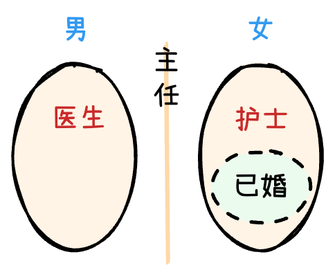

# 分析推理

## 真假分析

### 矛盾法
*   **找矛盾**：找到存在矛盾关系，必然一真一假。
*   **看其余**：结合真假数量确定矛盾以外的真假情况。
    1.   *只有一真，其余均为假。*
    2.   *只有一假，其余均为真。*
*   **矛盾关系**：
    *   A和非A
    *   A或B 和 非A且非B
    *   A且B 和 非A或非B
    *   所有和有些不，可能和必然不
    *   $A \rightarrow B$ 和 $A \rightarrow ¬B$

??? quote "例"

    **【例】（2022国考副省）** 小陈、小李、小刘3人从学校脱颖而出，到市里参加竞赛。5人预测：

    小陈、小李都获奖； $\rightarrow$ *陈且李*

    小陈、小李至多有1人获奖； $\rightarrow$ *非陈或非李*

    小陈获奖，小李未获奖； $\rightarrow$ *陈且非李*

    小陈未获奖，小李获奖； $\rightarrow$ *非陈且李*

    若小陈获奖，则小刘也获奖。 $\rightarrow$ *陈→刘*

    结果发现，**只有1人预测正确**。由此可以推出：

    A. 小陈、小李都未获奖 

    B. 小陈、小刘都获奖 

    C. 小李、小刘都未获奖 

    D. 小陈、小李都获奖 

    ---

    **【解】D。**

    *   **第一、二句矛盾**，*二者必有一真一假，故三四五句全为假*
    *   则根据第五句为假可推出：*陈且非刘*；再根据第三句为假可推出：*陈且李*

### 假设法
*   **假设条件，根据假设是否矛盾来解题。**
*    假设 P 成立，则 P→ ... → Q，得到 Q 成立
*    假设 P 不成立，则 ¬P → ... → R，得到 R 成立
*    $\Longrightarrow$ <mark style="background: #BBFABBA6;">*Q 或 R 一定为真*</mark>

!!! tip ""

    **P → Q 且 ¬P → Q $\rightarrow$ Q 一定为真**

    **P → Q 但 Q 不可能为真 $\rightarrow$ P 一定为假**

??? quote "例"

    **【例】（2019上海B）** 青少年高校科学营旨在充分利用重点大学的科技教育资源激发青少年对科学的兴趣，培养青少年的科学精神、创新意识和实践能力。班主任鼓励甲、乙、丙、丁四位同学报名参加暑假举行的科学营。几天后班主任向这四位同学询问录取的情况，他们的回答如下：

    甲：乙被科学营录取了。 $\rightarrow$ *乙*

    乙：丙被科学营录取了。 $\rightarrow$ *丙*

    丙：甲或者乙被科学营录取了。 $\rightarrow$ *甲或乙*

    丁：乙或丙被科学营录取了。 $\rightarrow$ *乙或丙*

    经过班主任调查，发现 **只有一位同学的回答与事实相符**。根据以上陈述，下列 *哪项为假*：

    A. 丙说的是真话 

    B. 乙没有被科学营录取

    C. 被科学营录取的不是甲 

    D. 丁说的是假话

    ---

    **【解】C。** 

    *   **假设甲为真**，*则丙，丁也为真，故甲为假* 
    *   **假没乙为真**，*则丁也为真，故乙为假* 
    *   综上可知乙、丙均未被科学营录取，*由此可推丁为假，故唯一剩下的丙为真* 
    *   甲或乙被科学营录取了，且乙没被录取，则可推出 *甲被科学营录取了*

### 代入法
*   代入选项判断命题真假。

??? quote "例"

    **【例】（2021广东县级）** 甲、乙、丙三人对一块花田里种植的花朵品种做了两次猜测：

    甲：①“它是月季”；②“它不是玫瑰” 

    乙：①“它不是月季”；② “它是玫瑰” 

    丙：①“它不是月季”；②“它不是牡丹”

    工作人员听到后表示：“你们三人中，**只有一个人两次都猜对了，一个人猜对了一次，还有一个人完全猜错了**。”如果工作人员的说法是对的，则该花田里种植的是：

    A. 玫瑰 $\rightarrow$ *代入后判断：甲全错，乙全对，丙全对*

    B. 月季 $\rightarrow$ *代入后判断：甲全对，乙全错，丙①错、②对。符合题意*

    C. 牡丹 $\rightarrow$ *代入后判断：甲①错、②对，乙①错、②对，丙①对、②错*

    D. 玫瑰、月李和牡丹之外的花种 $\rightarrow$ *代入后判断：甲①错、②对，乙①对、Q错，丙全对*

    ---

    **【解】B**

### 两真两假
*   **先找矛盾，再假设。**
*   **命题的真假判断：对于原命题 $A \rightarrow B$：只有 $A且¬B$ 时命题才为假。**

??? quote "例"

    **【例】（2022联考）** 欧洲杯比赛期间，小赵、小钱、小孙、小李预测甲、乙两支队伍能否进入决赛。他们的对话如下：

    ①小赵：如果甲进入决赛，则乙也能进入决赛。 $\Longrightarrow$ *甲 → 乙*

    ②小钱：我看甲进入决赛没有问题。 $\Longrightarrow$ *甲*

    ③小孙：在我看来，甲能够进入决赛，但乙进不了 $\Longrightarrow$ *甲且非乙*

    ④小李：我的看法是，如果甲不能进入决赛，则乙进决赛。 $\Longrightarrow$ *非甲→ 乙*

    结果出来后，四人的预测有 **两个真、两个假**，关于甲和乙是否进入决赛，以下推论正确的是：

    A. 甲和乙都进入决赛 

    B. 甲和乙都没有进入决赛

    C. 甲进入决赛，乙没有进入决赛 

    D. 甲没有进入决赛，乙进入决赛

    --

    **【解】D**

    *   ①③矛盾一真一假，所以②④为一真一假，**因此②假，即甲没有进入决赛**
    *   *(若②为真，则④也为真)*  [假言命题](逻辑基础/#_19){ data-preview}
    *   ②为假，由④非甲→乙可得，乙进入决赛，选D

---

## 范畴分析
*   **定义**：所有、有些、特指的相关考点。
*   **一分为二画图法**：
    *   找到题干中“所有A都是B”的描述，对B和非B做分类。
    *   **所有画实圈，有些可不画圈，不能确定的可以画在线上**。

??? quote "例"

    **【例】（2014吉林）** 某医院所有的医生都是男性，所有的护士都是女性，所有的已婚者都是护士，医务室主任尚未结婚。由此可知： {width=200 align=right}

    A. 医务室主任是男性 $\rightarrow$ *不确定*

    B. 已婚者中有男性 $\rightarrow$ *已婚者与男性无交集*

    C. 护士中可能有未婚者 $\rightarrow$ *未婚范围不确定，故护士中可能有未婚者*

    D. 医生中有的已经结婚 $\rightarrow$ *医生与已婚者无交集* 

    ---

    **【解】C**

---

## 日常分析
*   **代入法**：就是把选项代入题目，依次验证和排除。
*   **赋值法**：对于涉及到大小比较的题目，可以考虑使用赋值法。

    ??? quote "例"

        **【例】（2017国考副省）** 在某公司中，李明帮助了王刚，而王刚帮助子赵贤。李明纳税比赵贤多。由此可以推出：

        A. 王刚纳税比赵贤多

        B. 李明纳税和王刚一样多

        C. 有人帮助了一个纳税比他多的人

        D. 有人帮助了一个纳税比他少的人

        ---

        **【解】D**

        *   *李明 $\xRightarrow{帮助}$ 王刚 $\xRightarrow{帮助}$ 赵贤*
        *   假设李明纳税为 10，赵贤纳税为 5，则无论什么情况下，都有人帮助了一个纳税比他少的人

*   **画表法**：将已知信息填入图表，更直观进行逻辑分析。

    ??? quote "例"

        **【例】（2O22江苏A类）** 甲、乙、丙、丁4人为室友，来自江苏、浙江、湖南、湖北，毕业时都考上了研究生，录取她们的有师范大学、医科大学、财经大学、农业大学，已知：**甲考上的不是农业大学，考上农业大学的是江苏人，丙考上了师范大学，丁是湖北人**。
        如果 *考上医科大学的是湖南人*，那么以下哪项为 *假*：

        A. 甲考上了医科大学

        B. 丁考上了财经大学

        C. 丙不是浙江人

        D. 丙不是湖南人

        ---
        **【解】C**

        |甲|乙|丙|丁|
        |---|---|---|---|
        | *湖南* | 江苏 | *浙江* | 湖北 |
        | *医科* | 农业 | 师范 | *财经* |

## 选人模型
> 从 N 人中选 M 个人

### 数量归谬
- **时刻注意已选多少人，还剩多少人**

### N 选 N - 1 的问题
- 常见 3 选 2、4 选 3、5 选 4 等（例：甲乙丙 3 人选 2 人当代表）
	- <mark style="background: #FFB86CA6;">若选甲，则选丙 → 一定选丙</mark>（*若不选丙，则不选甲，甲乙丙不可能选到 2 人*）
	- <mark style="background: #FFB8EBA6;">甲或丙至少选一人 → 该命题一定为真</mark>

---