# 图形推理-平面类

## 位置规律

### 平移
*   **方向**：
    *   ① 直线（上下/左右/斜对角线） 
    *   ② 绕圈（顺/逆时针）
*   **步数**：
    *   ① 固定（不变） 
    *   ② 递增/减（等差、等比）
*   **路径**：
    *   ① 从头（循环跑） 
    *   ② 调头（反弹跑）
*   **移动的元素**
    1.   **整体看**：
        *   ① 两个或多个黑块相连，可看作一组
        *   ② 两个或多个黑块间隔的白块数量恒定，可看作一组
        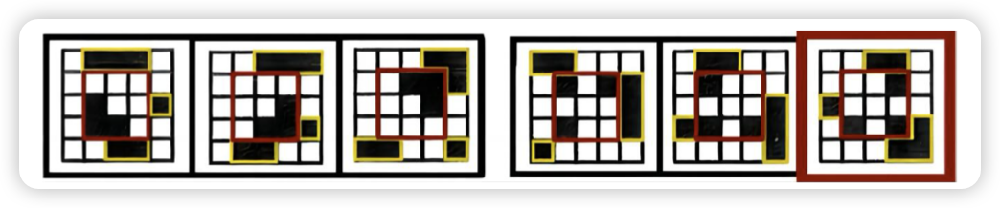{width=80%}
    2.   **分开看**：
        *   **就近原则**：最短移动距离为同一元素
        *   **位置重合**：个别图黑块减少
    3.   **特殊形态（移动的元素）**：空白、端点/交点、线条
    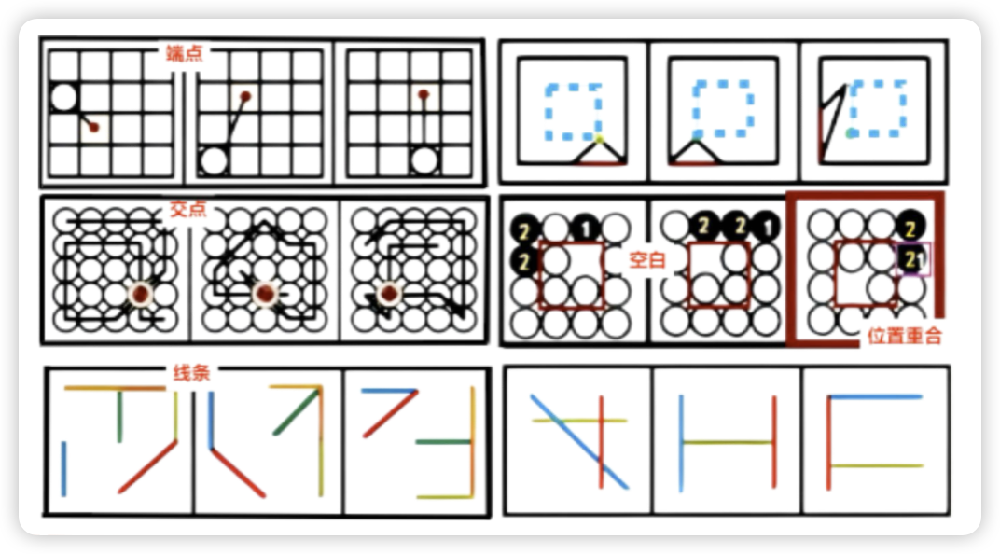{width=80%}

*   **宫格型**：
    *   **中间不变**：优先考虑顺逆时针走外圈
    *   **中间变化**：
        *   若有规律：优先考虑内外圈分开看
        *   若无规律整体看：
            *   行的数量不变，优先左右移动
            *   列的数量不变，优先上下移动
            *   行列的数量均不变，优先看不动

### 旋转
*   **方向**：绕圈（顺/逆时针）
*   **角度**：恒定、递增/减
*   （整体旋转与局部旋转；旋转 + 元素加减）

### 翻转
*   两图横轴对称：上下翻
*   两图竖轴对称：左右翻
*   两图中心对称：旋转180°

---

## 样式规律

### 遍历
> **相同元素重复出现**（九宫格和两组图中居多） *（缺啥补啥）*

*   **形状遍历**：
    *   ① 外框形状的遍历 
    *   ② 内部线条/阴影/空白的遍历
*   **数量遍历**：
    *   ① 每种样式的图形在行列中出现的次数相同 
    *   ② 每一组图都有一个相同的元素
*   **位置遍历**：相同样式图形在每个位置出现
*   **偏旁遍历**：汉字类

### 加减同异
> **相同线条重复出现** *（常与旋转和翻转结合考查）*

*   **加减**：图形、线条之间加减
*   **去异存同**：去掉不同部分，相同部分组成第三个图
*   **去同存异**：去掉相同部分，不同部分组成第三个图

### 黑白运算
*   对相同位置的黑白块进行运算

*   **规则**：
    *   ① 具体图形具体找 *（“具体图形”不一定必须是黑白块，也可能是其他元素）*
    *   ② 黑加白不一定等于白加黑
    *   ③ 横看横找，竖看竖找
    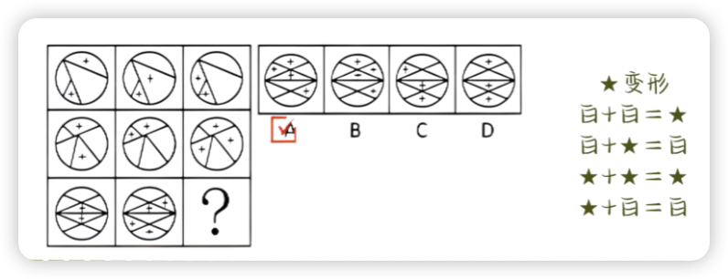{width=80%}
    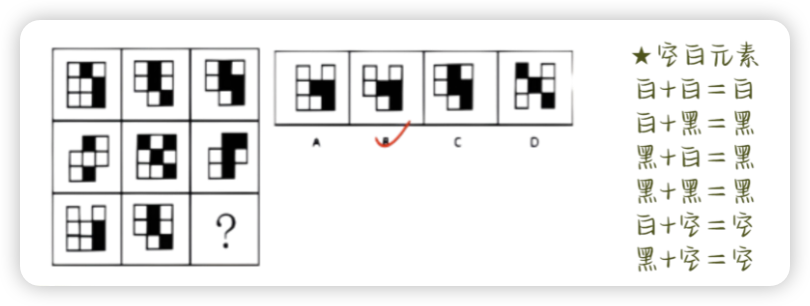{width=80%}

*   **注意**：
    *   黑块数量相同，优先位置平移
    *   黑块数量不同，优先黑白运算

---

## 对称和开闭性

### 对称性

*   对称性质
    1.  **轴对称**
    2.  **中心对称**
    3.  **中心+轴对称**

    > ① 不同性质交替出现 ② 根据性质分类分组

    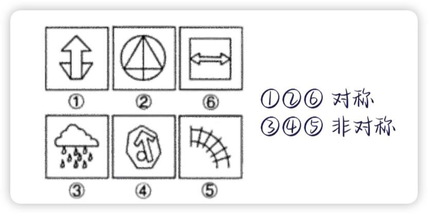{width=80%}

*   对称轴数量
    1.  **数数**：恒定/交替出现/递增递减
    2.  **运算**：加减乘除

    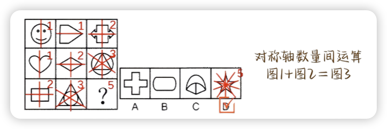{width=80%}

*   对称轴方向
    1.  **方向不变**：横/竖/斜
    2.  **依次变化**：顺/逆时针旋转

*   对称轴 + 原图形
    1.  对称轴经过原图的【点/线/面】
    2.  对称轴经过原图的【点/线/面】的【数量】
    3.  对称轴与原图中的线【重合/平行/垂直】

    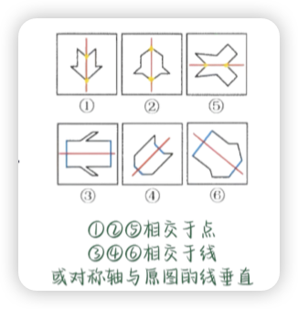{width=300}

*   组合图
    1.  **图形间关系**：
        1.  ① 对称性质：一样/不同 
        2.  ② 局部对称：仅部分图形对称
    2.  **图形间对称轴的关系**：重合/垂直/平行
    3.  关系：*黑/白、内/外、左/右、上/下、最大面/最小面*

    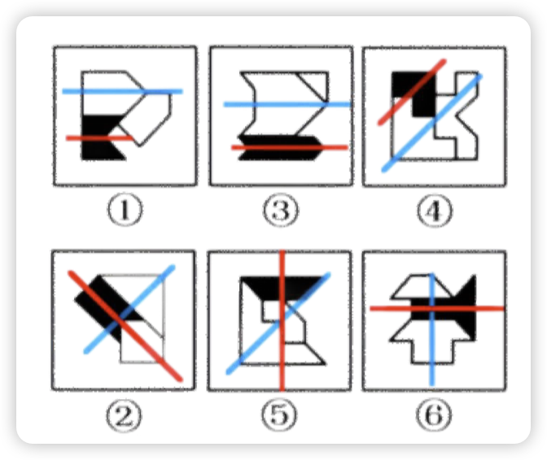{width=300}
### 开闭性
-   **开放图形**：图形不含封闭空间（有缺口）
-   **封闭图形**：图形整体处于封闭状态（有外框且无缺口）
-   **半开半闭图形**：图形既包含封闭空间又有暴露在外的端点
-   **判别**：
        -   完整图形有缺口
        -   图形有阴影/粗线条
        -   出现数字(0,4,6,8,9)/字母

---

## 线-曲直性 

### 属性
*  **全直**
*  **全曲**
*  **曲+直**

### 数量
*  **数直线**：直线只要不积弯就是1条直线
*  **数曲线**：区分曲线：看拐点
*  **数曲直线的和/差**：
    1.  ① 曲直分开数，各自均呈规律 
    2.  ② 曲直一起数，和/差呈规律

### 位置
*  **上曲下直、上直下曲**
*  **左曲右直、左直右曲**
*  **内曲外直、内直外曲**
    1.  外框所有的线/曲线/直线
    1.  内部所有的线/曲线/直线
    1.  内外【所有线/曲线/直线】的和/差

    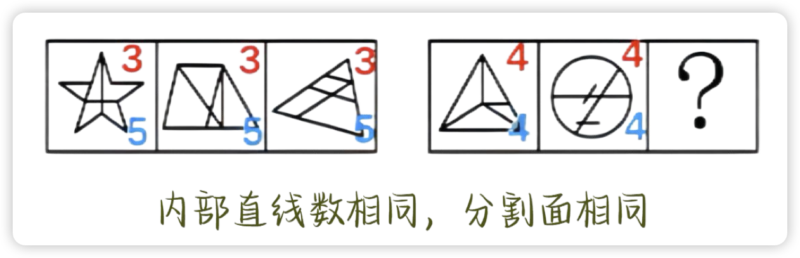{width=80%}

### 方向
*   横向、竖向、斜向(45°)

### 特殊线
*  **横竖线**：横平竖直很明显
*  **平行线/平行线组数**：多线方向一边倒
*  **组成封闭面的线(局部)**：每幅图都有多边形
*  **贪吃蛇**

    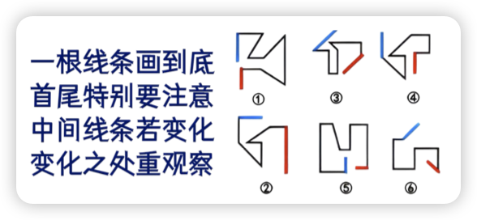{width=300}

*  **延伸线**：
    *   延伸线的数量 {width=60}
    *   延伸线的位置（交点/边）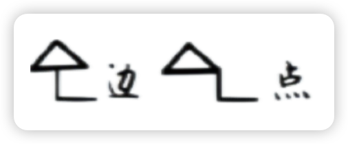{width=80}
    *   延伸线有几条线段 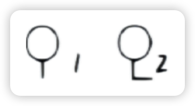{width=60}
    *   延伸线的线段数与轮廓数关系 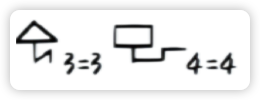{width=80}

---

## 线-笔画数 

> *出现五角星、圆相切/相交、“日”字变形、“田”字变形、出头端点，考虑笔画数。*

### 一笔画
*  **奇点数 = 0 或 2**
*  **连在一起的一部分图形**
*   **一笔画捏合技巧**：去除封闭空间后，剩余几笔就是几笔画（剩余两笔）。

    注意：不能重复去除同一条线段。

### 多笔画
1.  **多部分图形**（多部分的笔画数相加）
2.  **一部分图形且奇点数 > 2**
3.  **笔画数 = 奇点数 / 2**

### 数奇点
1.  一个点引出的射线数为奇数，该点称为奇点；若为偶数，则称为偶点。
2.  在图形推理中，图形是连笔部分，则可数它的奇点有多少个。
    *   端点处只放射出一条线（奇数），故端点也是奇点。
    *   多部分图形虽然不一定有奇点，但一定是多笔画。

---

## 点

### 图形特征
> 大树叉、线条交叉明显，绕来绕去的一团线
> 
> 切点多、圆相交
> 
> 类似数面特征，但面数量无规律时

### 点的类型
*   **圆点**：① 补充/计算数量时用 ② 功能元素
*   **交点**：
    1.  **所有交点**
    2.  **局部交点**：
        *   曲直交点
        *   内部交点
        *   圆内交点
        *   外框交点（指里面的线与外框相交的点）
*   **切点**
*   **出头点**：出头点是端点，不是交点

*   数量特征
    *   乱序：交点的数量无序，但可以排成有序
    *   固定、周期、等差

## 角

!!! tip ""

    1.  只数小于180°的角。
    2.  直线与直线相交的才叫角。
    3.  角不重复数，三角形可重复数。
    4.  如果图形是封闭图形，图形外的角一般不数。
    5.  在数角的过程中不能跨线去数。

### 数角
*   **总角数**
*   **直角数 / 锐角数 / 钝角数**

    注意数量规律（①固定不变 ②奇数递增/减 ③等差/等比）。基本考察的是直角数。

### 角的性质
1.  都有直角
2.  都有锐角
3.  都有钝角

### 有角/无角
*   全直线图形一般有角，全曲线/圆润图形一般无角。

### 扇形（角度递增）
*   观察扇形开口角度的变化。
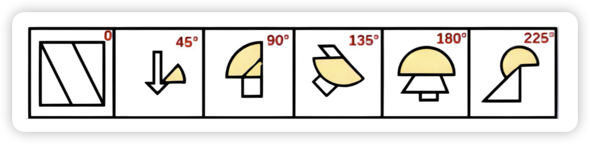{width=80%}

## 面

### 所有面
*   分分数三角形/四边形/多边形的个数（**三角形可重复数！！**）

### 部分面
-  **某一形状的面** 

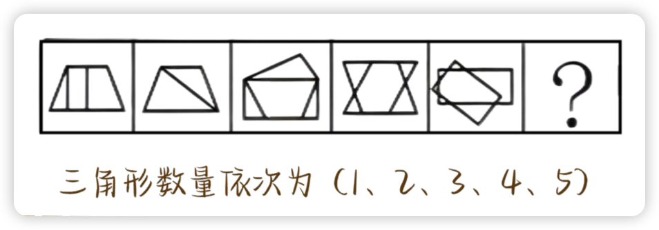{width=80%}

-  **相同形状的面**

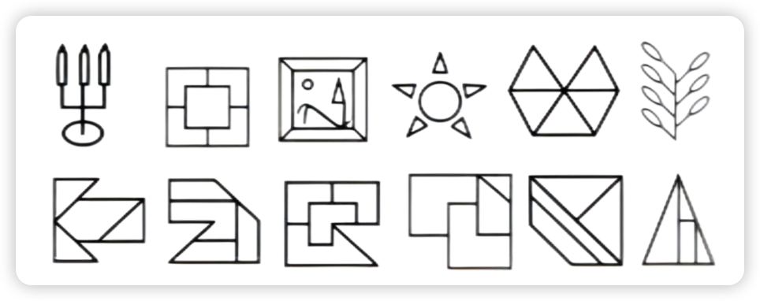{width=80%}

### 单个面
-  **最大面的形状**

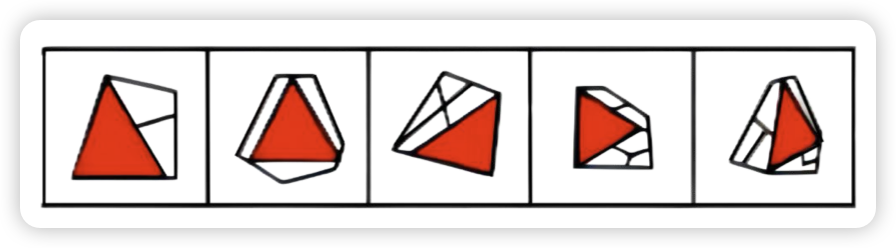{width=80%}

-  **最大面的面积**

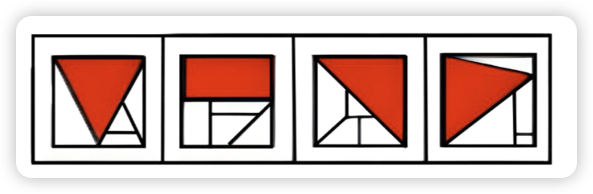{width=80%}

-  **最大面的属性**（轴对称/中心对称等）

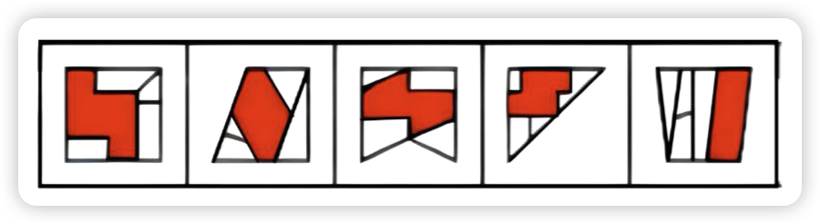{width=80%}

-  **最大面/最小面与外框是否相似**

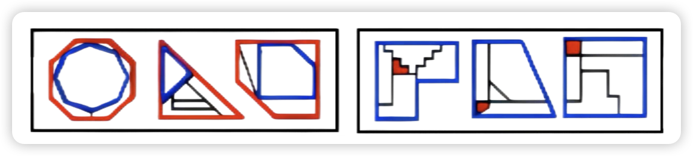{width=80%}

### 注意
*   同时出现数面、数线、数笔画、数点的特征图时，**优先数面**。
*   出现汉字、字母、符号、生活化意义元素以及粗线条图形时也 **数面**。

## 素

*   特征

    > 很多 ▲ ★ 等小元素
    > 
    > 生活化图形
    > 
    > 黑色粗线条图形

*   种类
    *   字母 / 形状 / 颜色

*   数量
    1.  **总数**
    2.  **个别种类的数量**
    3.  **种类间数量运算**

    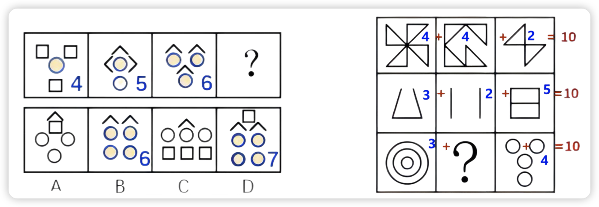{width=80%}

*   元素间换算

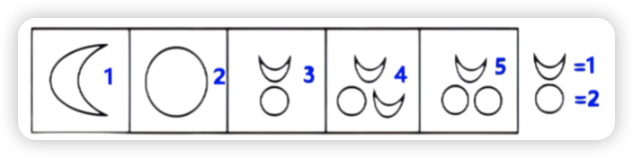{width=80%}

*   内部元素相同

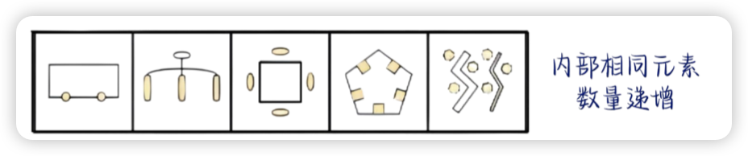{width=80%}

*  相邻两图元素异同

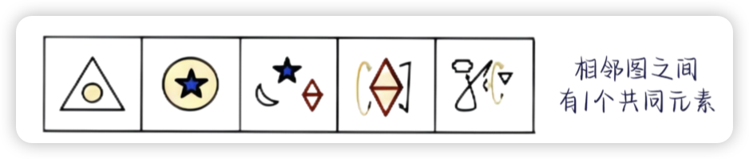{width=80%}

*   数部分
    1.  **区分面与部分数：面指白色的封闭区域；** 黑白块也常考部分数。
    2.  **定义**：线条与线条连在一起的叫做一部分。
    3.  **图形无分离为1部分**。

---

## 图形间关系

*   相离
> 多个图形独立分开。

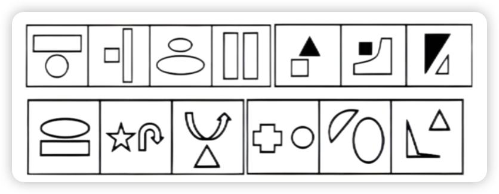{width=80%}

*   相交于点
> 多个图形连接处为交点/切点。

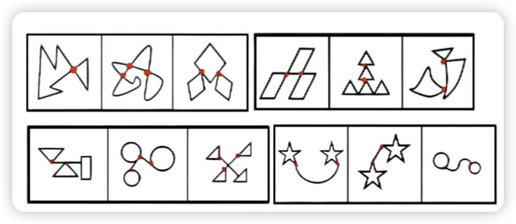{width=80%}

*   相交于线
> 多个图形连接处为“线”。
    1.  连接线的长短（分组分类）
    2.  连接线的数量
    3.  连接线的曲直性

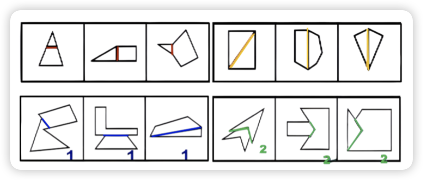{width=80%}

*   相交于面
> 两个图形的面交叉重叠
    1. 相交面的形状（相似）
    2. 相交面的属性（对称）

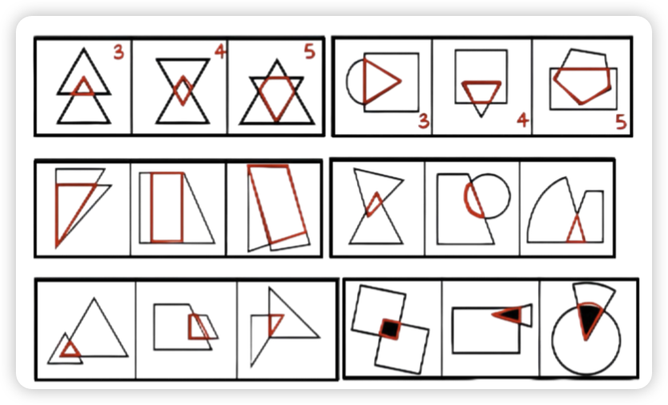{width=80%}

---

## 功能元素

*   相对位置 *（上、下、左、右、内、外）*

*   标记点

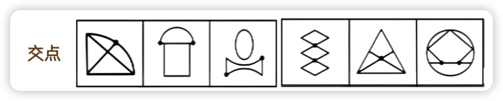{width=80%}

*   标记线
    1.  直线/曲线
    2.  最长线/最短线

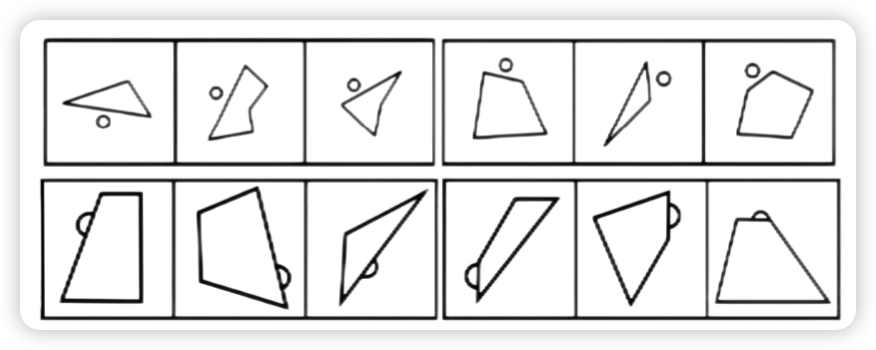{width=80%}

*   标记面
    1.  相交面
    2.  最大面/最小面
    3.  直线面/曲线面多

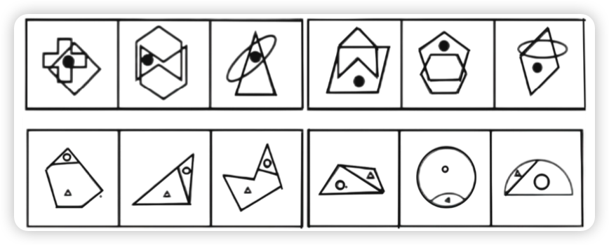{width=80%}

*   标记角
    1.  最大角/最小角
    2.  直角/锐角/钝角

{width=80%}

*   特殊
    *   黑点连线与原图关系（平行/垂直）。

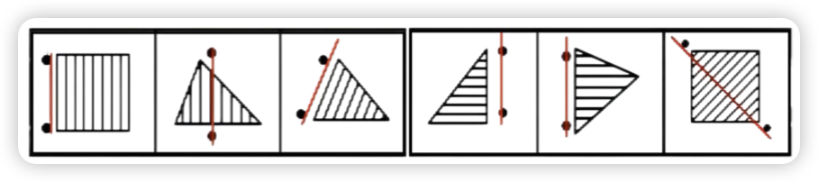{width=80%}

---

