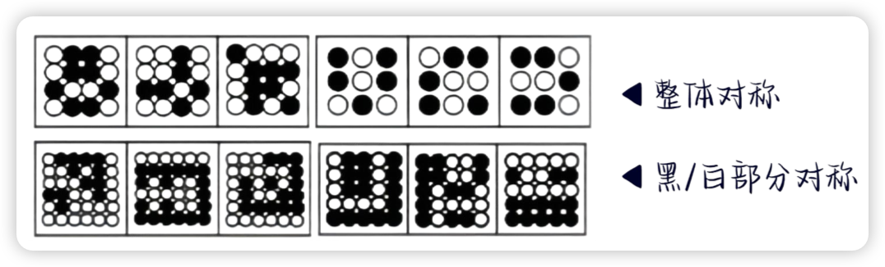
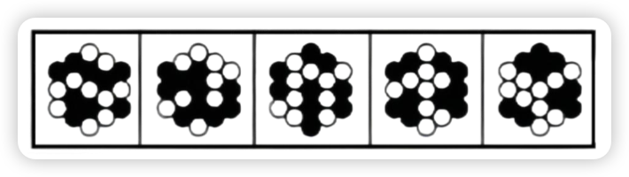
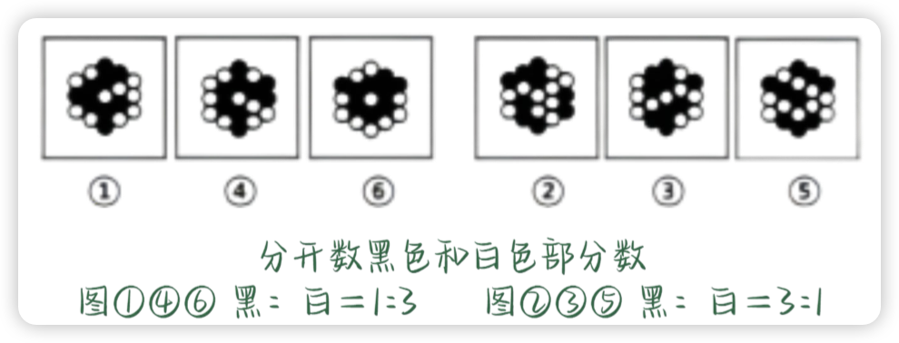
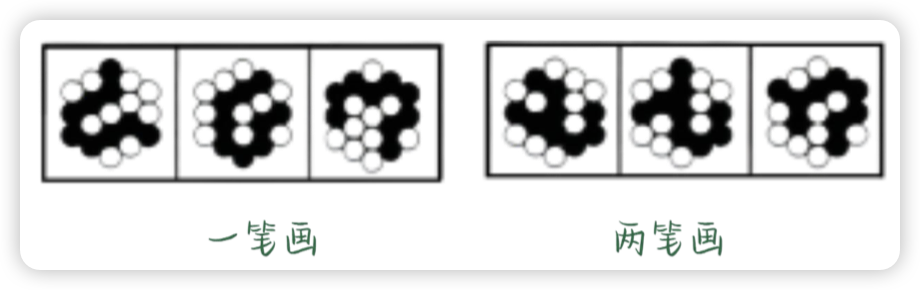
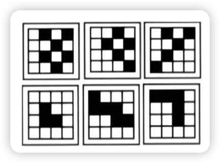
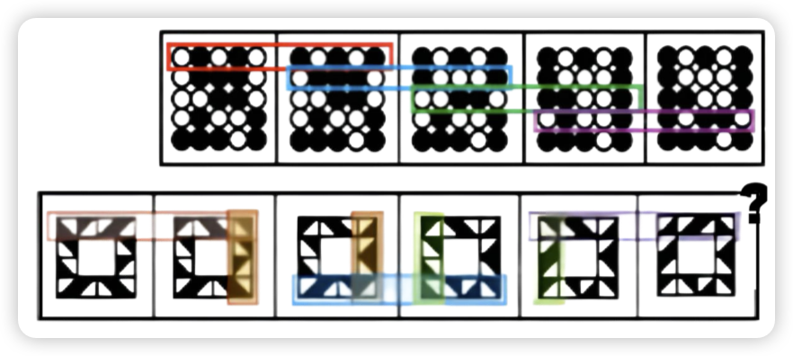
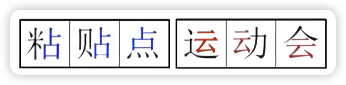
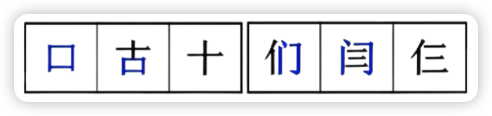

# 图形推理-特殊类

## 黑白块

### 对称性
*   整体对称
*   黑色/白色部分对称

{width=80%}

### 面
*   黑色面积占整体的比例关系
*   黑色面积 = 白色面积
*   相同形状黑块的数量

{width=300}

### 数量
*   **数量相同**：平移
*   **数量不同**：
    -  直接数

    {width=80%}

    -  黑白运算

### 连接
*   连接部分
    -  **部分数**：黑色部分 / 白色部分

    {width=80%}

    -  **笔画数**：一笔画 / 两笔画（黑白块连成的线）。

    {width=80%}

*   **连接方式**：点连接 / 线连接。

{width=300}

### 相邻比较
*   按行按列对比，找出相同和不同。

{width=80%}

---

## 汉字类

*   结构
    *   内外：全包围、半包围
    *   上下、左右

*   样式
    *   遍（结构/偏旁遍历）

    {width=300}

    *   加减同异

    {width=300}

*   属性
    *   对称性、曲直性、开闭性

*   数量
    1.  **点**：交点、孤点
    2.  **线**：横/竖、撇/捺（曲/直）
    3.  **笔画数**：汉字的笔画数就是字典中实际的笔画数！！！（例如：乙-1笔，阝-2笔）
    4.  **面**：封闭空间数量
    5.  **部分数**

*   特殊
    1.  **拼音音调**：一声、二声、三声、四声
    2.  **拼音字母个数**
    3.  **笔画顺序**：起笔（点、横、竖...）

---

## 数字类

*   属性
    *   **对称性**：轴对称、中心对称
    *   **曲直性**：全曲(0,3,6,8,9)、全直(1,4,7)、曲+直(2,5)
    *   **开闭性**：开放(1,2,3,5,7)、封闭(0,8)、半封闭(4,6,9)

*   封闭面的数量
  *   0个面：1, 2, 3, 5, 7
  *   1个面：0, 4, 6, 9
  *   2个面：8

*   特殊
    1.  **数字本身写法** (顺/逆时针)
    2.  **数字本身大小比较**
    3.  **数字本身运算**

*   遍历
    *   已出现的数字不再出现（例如数独）

---

## 字母类

*   属性
    1.  **对称性**：轴对称(A,B,C,D...)、中心对称(N,S,Z)
    1.  **曲直性**：全曲(C,O,S,U)、全直(A,E,F...)、曲+直(B,D,G...)
    1.  **开闭性**：开放、封闭(B,D,O)、半封闭(A,P,Q,R)

*   数量
    1.  **面**：0个面、1个面(A,D,O...)、2个面(B)
    1.  **点**：交点数、弧点数(i,j)
    1.  **线**：笔画数（例如：M,B,P,L 一笔画）、曲直线数量
    2.  **素**：种类、位置

*   特殊
    1.  **字母本身顺序**：A B C D E... (隔几位)
    2.  **字母本身写法**：笔画顺序

---