# 图形推理-空间类

## 展开图

### 六面体

*   结构
    1.  “1-4-1”结构

        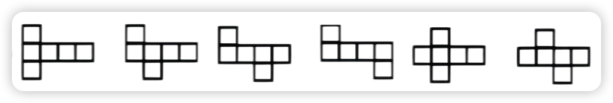{width=80%}

    2.  “2-3-1”结构

        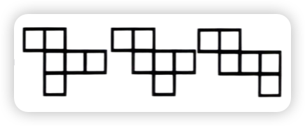{width=200}

    3.  “2-2-2”结构

        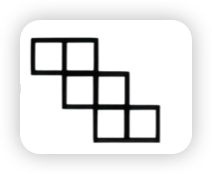{width=100}

    4.  “0-3-3”结构

        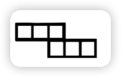{width=100}

*   **旋转法**
    1. 141 模型

        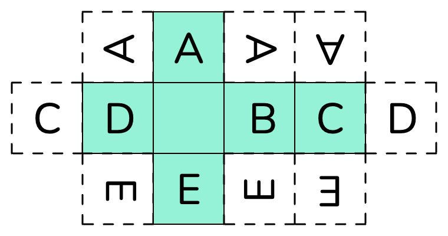{width=50%}

    2. 231 模型

        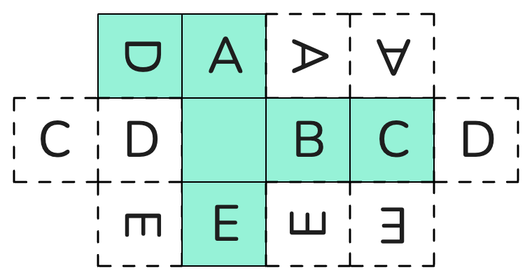{width=50%}

    3. 222 模型

        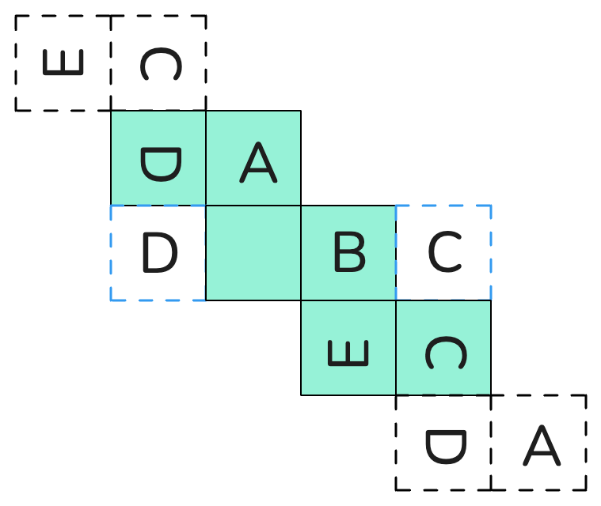{width=50%}

    4. 33 模型

        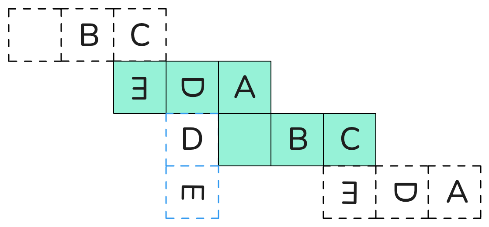{width=50%}

*   相对面
    1.  同行/同列隔一面为相对面
    2.  Z两端为相对面

        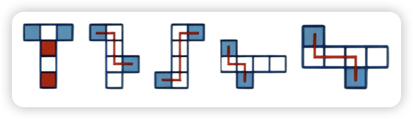{width=80%}

        *立体中相对面不能同时出现*

*   公共边
    1.  平面图中构成直角的两条边是公共边
    2.  一列/行连着4个面，最两侧的两条边是公共边
    3.  “3+1的L”型同方向的两条边是公共边
    
        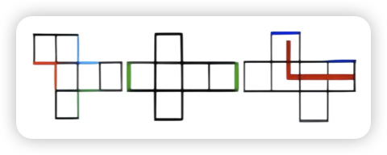{width=300}
        
        *（两个面的公共边是唯一的）*

*   “L”型画边法
    1.  以三面公共顶点出发，沿外框往两侧走
    2.  仅一侧遇到转角继续走
    3.  两侧同时遇到转角就停（两侧同时对应的为公共边）

        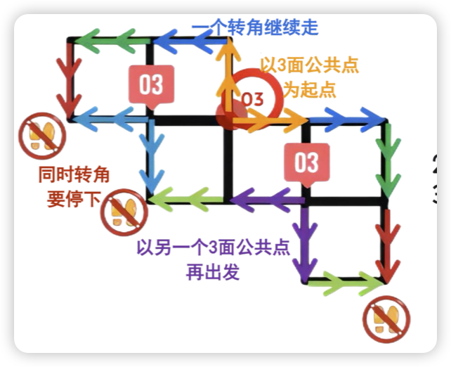{width=300}

*   顺时针画边法
> 结合选项（描同一个面）：
    1.  找一个特殊的唯一的一点或唯一的一边
    2.  顺时针方向描边标号
    3.  题干与选项对应面不一致的排除

        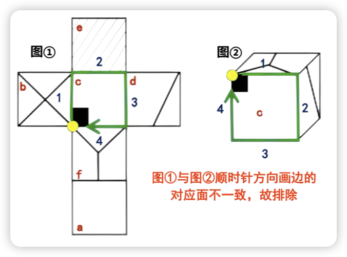{width=300}

*   公共点
    *   **“马走日”法**：从同一面上画“日”字对角线，对角线对应的另一端点就是公共点。

    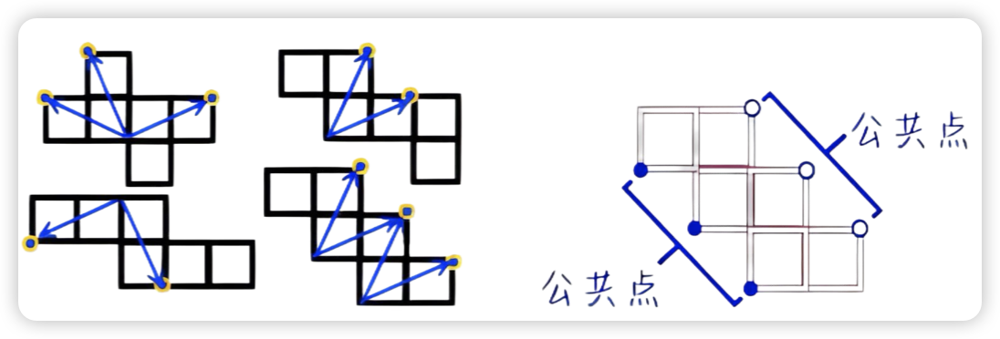{width=80%}

### 四面体
*   立体图：可视面2个，相邻面2个，公共边1条。
*   展开图

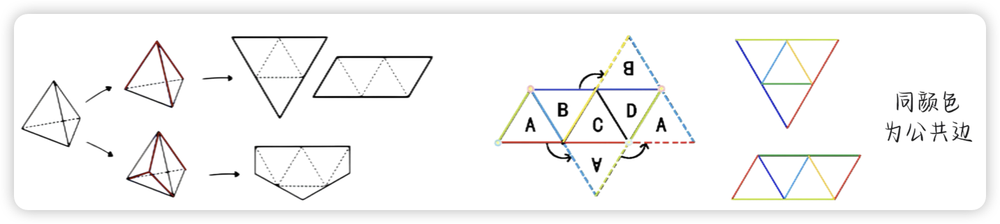{width=80%}

---

## 截面图

### 六面体
*   可切图形：
    1.  三角形：*只能截锐角三角形*
    2.  四边形：*无法截出直角梯形*
    3.  五边形：*无法截出正五边形*
    4.  六边形：*六面体图形边数最多只能截出六边形*
*   **考察重点：**
    1.   三角形的切法（斜向）
    2.   矩形的切法（竖直，水平，斜向均可）
    3.   梯形的切法（斜向）

    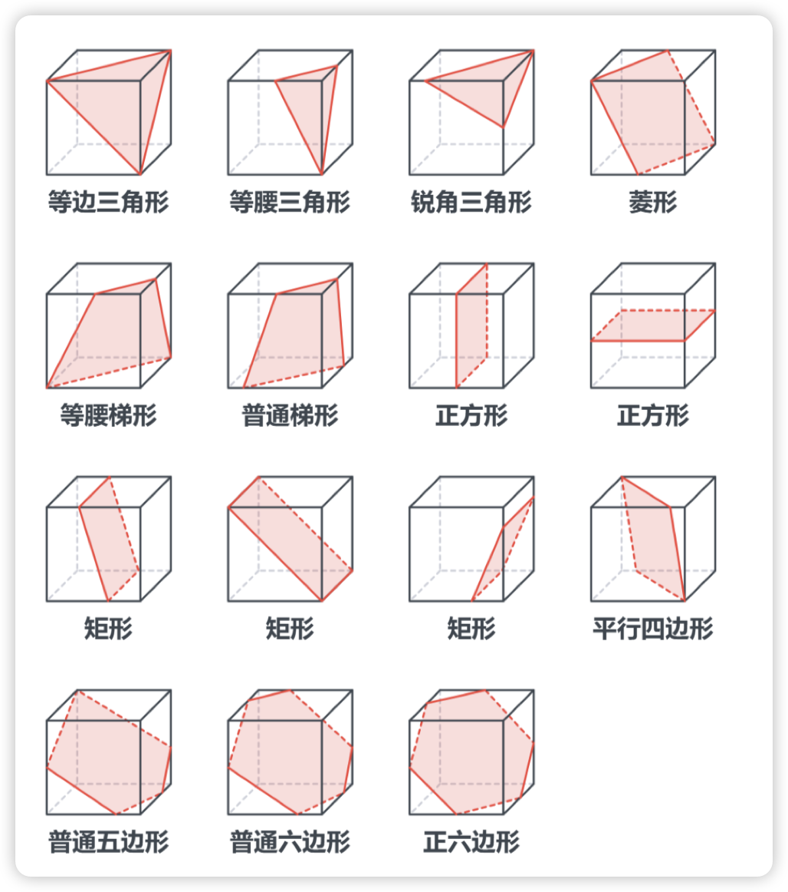{width=80%}

### 圆柱体
*   可切图形：
    *   圆柱体可以截出 *圆形*、*矩形*、*椭圆*、*曲线+直线* 以及 *鼓形*
    *   **无法截出梯形**

*   **考察重点：**
    1.  矩形的切法（竖直）
    2.  正圆的切法（水平）
    3.  椭圆的切法（切向）
    4.  曲线的切法（斜切）
    5.  重点是 **矩形只能竖直切**。

    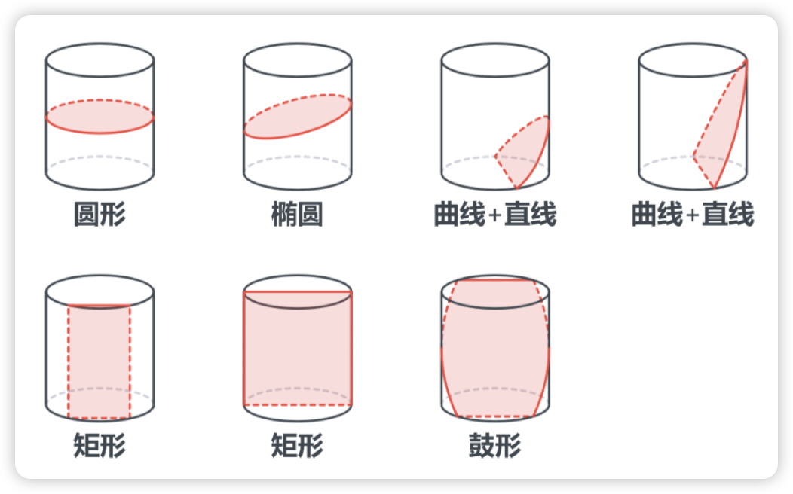{width=80%}

### 圆锥体
*   可切图形：
    - 圆锥体可以截出 *圆形*、*椭圆*、*抛物线*、*双曲线* 以及 *三角形*
    - **无法截出四边形**

*   **考察重点：**
    1.  等腰三角形切法（竖直）
    2.  正圆的切法（水平）
    3.  椭圆的切法（切向）
    4.  曲线的切法（斜切）
    5.  重点是 **三角形只能竖直切**。

    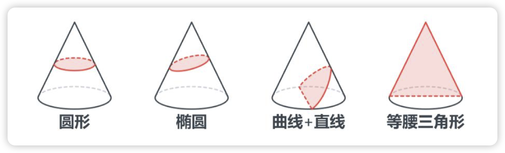{width=80%}
 

---

## 三视图

*   **(1) 观察到的视图都是平面图**：主视图、左视图、俯视图。
    *   **原则**：长对正、高平齐、宽相等。
*   **(2) 某些角度下弧或斜线会被压平原图**：两个直面交接，有实线且斜线被压平。
*   **(3) 原图有线就有线，原图没线就没线**：曲面平滑交接，无线。
*   **(4) 当被遮挡住时，看不见被遮挡的部分**：底视图（少考，但不能忽视）。

---

## 立体拼合

*   解题思路
    1.  **数个数**
    2.  **试拼**：找特殊块→“占地大”的，最好横跨所有层级。
    3.  **分层画图法**：化立体为平面、化拼为拆。
    4.  **分层凑数法**：“0空间”想象，适用不用翻转的。

*   解题技巧
    *   特殊块先拼 + 平面图确定空位。

*   凹凸拼合
    *   **思路**：有凹必有凸，凹凸一致，长短一致，严丝合缝。

--- 