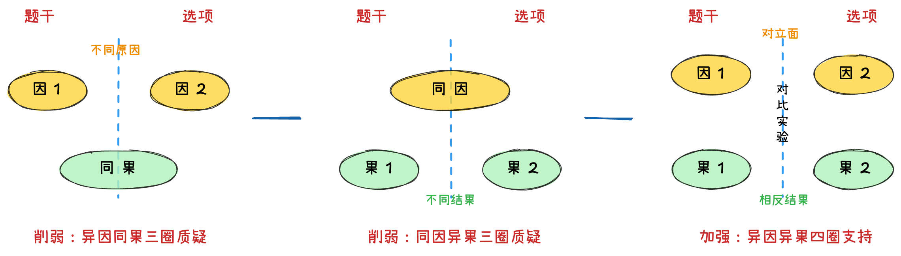
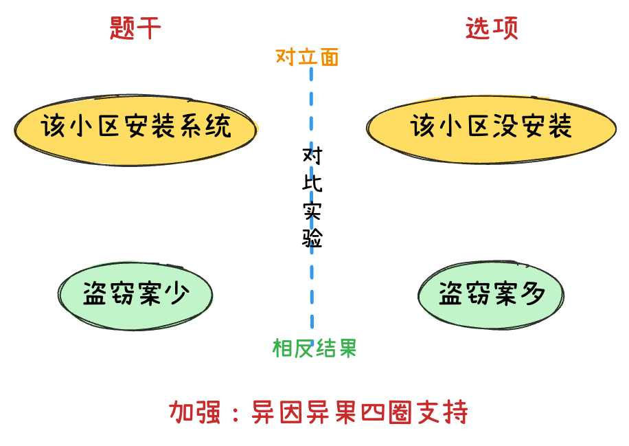
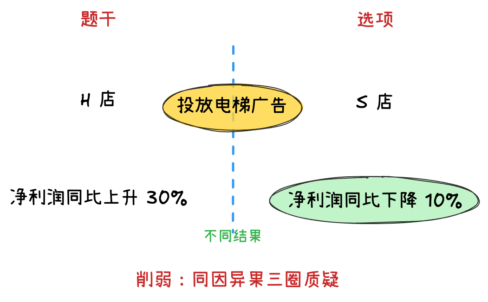
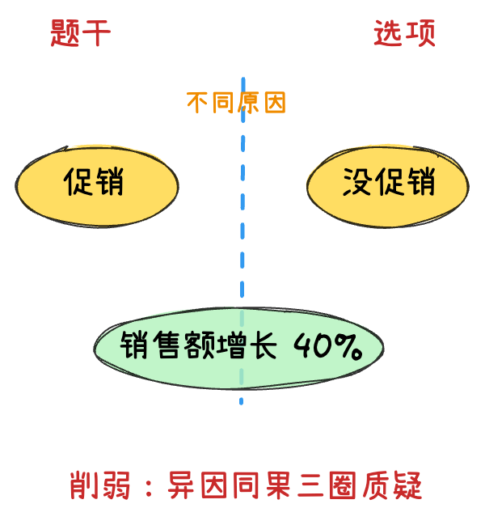

# 归因论证

## 归因论证

### 提问方法
*   以下哪项如果为真，最能削弱上述结论？
*   以下哪项如果为真，最能质疑研究人员的解释？

### 题目形式
*   **既成事实 + 原因分析**
    *   *有些题目原因分析会省略，直接给出结论或建议*
    *   **【例】** 许多大城市的中小学校门口，在每天早晚交通高峰期都能看到接送孩子车辆排长龙。有人认为，开车接送孩子上学是导致交通严重拥堵的原因。
        *   *既成事实：学校门口堵车*
        *   *原因：开车接送孩子*

### 归因和因果关系的区别
*   **归因：** 要有既成事实（完成时态），讨论因果关系。
    *   *例：小明考上了，是因为他努力。*
*   **因果：** 不需要有既成事实，A导致B。
    *   *例：休息不好会导致考试发挥不好，成绩下降。*

### 题型分类
1.  **对比实验归因**
    *   *① 另有他因*
    *   *② 因果倒置*
    *   *③ 否定此因*
2.  **一般归因** (只是省略了对比实验过程)
3.  **直接根本原因**
4.  **构成对比实验**

---

## 对比实验归因

### 题干特征
1.  有完整的对比实验过程，并根据实验结果给出原因分析、结论或建议。
2.  不同时间段对比，也可看做对比实验（少数）。

### 选项特征与解题思路
*   **正确选项：** 分组正确。
*   **错误选项：**
    1.  **特例选项：** 是正确答案的概率极低（关键词：有些/个别/特例...）
    2.  **实验瑕疵类：** 样本量不足、样本未全覆盖。
    3.  **无关选项：** 话题不一致、未谈原因、谈其他话题的原因...
    4.  **不明确选项无法削弱：** “并不一定”、“应该”...
*   **质疑力度：** **否定此因 = 因果倒置 > 另有他因**

---

### 削弱与加强方式

!!! note ""
    **【例】** 《英国医学杂志》发表的一篇研究成果显示：吃白米饭最多的人和最少的人相比，患糖尿病的风险会增加55%。有人据此得出结论，多吃白米饭易患糖尿病。

- 根据题干既定事实画出对比实验参照图

    1. 吃白米饭多的 ｜ 吃白米饭少的（因）
    2. 患病的概率高 ｜ 患病的概率低（果）
  
- 根据分组以及对比实验归因常见质疑方式预判答案
    
     1.  **另有他因**
         *   **需分组正确，回到实验，把水搅浑**（较少数会根据结果重新分组）
         *   **引入他因削弱：** 吃白米饭多人/少的这些人，还怎么怎么样（例如：吃白米饭多的人主要从事体力劳动/不爱运动）。
         *   **排除他因支持：** 除了吃白米饭多少不一样外，其他影响糖尿病的习惯都一样。

     2.  **因果倒置**
         *   **注意时间先后顺序**。让原因发生在后果之后否定此因（常带“只有...才”兼时间关系）。
         *   *例：随着患糖尿病风险增高，人们会不自觉吃更多白米饭。*

     3.  **否定此因**
         *   **只是有理由的否定此因**。
         *   *例：多吃白米饭不会提高患病概率。*

     4.  **构成对比实验**
         *   **补充对照组：** 题干往往只会给出实验组数据，补充另一组数据加强削弱。
         *   **削弱：异因同果** (吃白米饭少的人患病概率也是55%)
         *   **加强：异因异果** (吃白米饭少的人患病概率为10%)
   
        

---

## 对比实验例题

??? quote "另有他因"

    === "例 1"

        **【例】(2023联考)** 研究人员基于生物库大样本队列，采用生物电阻抗测量脂肪含量，分析其与死亡风险的关系，结果显示脂肪含量过少与死亡风险增高存在关联。研究人员认为，**脂肪含量过少的人，死亡风险会增高。** 
        
        以下哪项如果为真，最能 *削弱* 上述结论？

        A. 在生活方式不健康的人群中，脂肪含量 **过多或过少均会增加死亡风险** $\rightarrow$ *支持*
        
        B. 脂肪含量过多给人的带来的死亡风险，**高于** 脂肪含量过少带来的死亡风险 $\rightarrow$ *题目中无比较，无关*
        
        C. **脂肪含量过少和死亡风险高都是由疾病带来的**，疾病是二者的共同原因 $\rightarrow$ **另有他因**
        
        D. **脂肪的饮食可以改善** 血脂的代谢、降低胆固醇、降低低密度脂蛋白的水平 $\rightarrow$ *无关*
        
        ---

        **【解】选 C。**
        
        * **都是疾病带来的结果，二者间没有因果关系**
        
        * （这些人死亡风险高，不是因为脂肪含量少，而是疾病）
        
            > <pre style="font-family: 'LXGW WenKai';">
            **因**   脂肪含量过少     脂肪含量非过少 
            **果**    死亡风险高          死亡风险低
            </pre>

    === "例 2"

        **【例】(2021浙江)** 1990年W市70岁以上老人骨折发生率很高，同时70岁以上老人的死亡率也很高，因此可以得出 **骨折高发导致** 了70岁以上老人死亡率的上升。
        
        以下哪项为真最能 *削弱* 上述结论：

        A. 1990年，W市正在经历战乱 

        B. W市很多70多岁以上的老人都是独居老人  $\rightarrow$ *没有体现与往年对比* （改成：1990年，W 市独居老人较多，就是他因质疑）
        
        C. 此后十年，W市70岁以上老人的骨折率和死亡率一直很高 $\rightarrow$ *题干没谈论未来的事，无关项*
        
        D. W市60岁到65岁老人骨折发生率是70岁以上老人的2倍 $\rightarrow$ *分组错误*

        ---
        
        **【解】选 A。** 
        
        *   **时间对比实验：** 1990年 VS 其他年份

        *   A项 回归实验，分组正确，**给两组找到了不同的变量：战乱**

        *   **他因质疑**：可能⠀⠀⠀⠀是因为战乱导致死亡率
        
            > <pre style="font-family: 'LXGW WenKai';">
                    **1990年**               **往年**
            **因**  老人骨折率高    骨折率相对低
                    *战乱*            *没有战乱*
            **果**      死亡率高       死亡率正常
            > </pre>

    

??? quote "因果倒置"

    **【例】（2020浙江）** 研究发现，**人们在社交媒体上花费的时间越长，越容易感到孤独**。研究人员招募了1787名19岁至32岁的成年人，让他们完成一份问卷。调查发现，在社交媒体上每天花费时间超过120分钟的人感受到的孤独，大约是那些每天费时少干30分钟的人的两倍。研究人员解释说，这可能是因为人们在社交媒体上花的时间越多，现实世界中与人交流的时间就越少，因此越容易感到孤独。

    以下哪项如果为真，最能 *削弱* 上述研究结论：

    A. 越容易感到孤独的人越喜欢用社交媒体 $\rightarrow$**因果倒置**：先孤独后玩社交媒体

    B. 越喜欢用社交媒体的人，对生活的满意度越低 $\rightarrow$*与为什么孤独无关*

    C. 人们越来越喜欢通过社交媒体来了解其他人的生活 $\rightarrow$*与为什么孤独无关*

    D. 人们喜欢在社交媒体上发布积极经历，容易使接收此类信息的人心态失衡 $\rightarrow$*与为什么孤独无关*

    ---

    **【解】选 A。**

    * **因果倒置：** 先孤独后玩社交媒体

    * *B、C、D 项与为什么孤独无关*

??? quote "否定此因"

    **【例】（2022北京）** 某研究调查了数千名被试者的睡眠情况与健康状况，结果发现从中年至老年（50至70岁间）一直处干较短睡眠模式（即每晚睡眠时长少干6小时）的人，失智风险会增加30%。研究者呼吁 **中老年人适当增加睡眠时长，可以预防失智的发生**。

    以下陈述如果为真，哪项最能 *质疑* 研究者的观点：

    A. 老年人每日睡眠时间过长不仅会有疲劳感，还会记忆力降低，精力不集中

    B. 随着年龄的增加，身体的细胞也慢慢衰老，这就导睡眠时间开始变短

    C. 心血管代谢问题和精神疾患等都是失智的重要风险因素

    D. 失智是一种因脑部疾病所导致的渐进性认知功能退化，跟睡眠时长无关 $\rightarrow$**直接否定此因，当选**

    ---

    **【解】选 D。** *结论是给出对策，隐含了一个归因“睡得少导致失智”*

    * A：睡太长的危害。与睡得少无关

    * B：只说了为什么睡眠变短，并没说短了以后会不会失智

    * C：没回到实验本身，没提到睡眠和失智是否有关，无关项

        （可以改为：*睡眠时长少的人心血管代谢问题和精神疾患患病率显著增加*）

---

## 构成对比实验例题

??? quote "支持"

    **【例】(2019联考)** 某居想小区盗窃案件频发，在小区居民的要求下，物业于去年年初为该小区安装了一种多功能防盗系统，结果该小区盗窃案件的发生率显著下降，这说明 **多功能防盗系统能有效降低盗窃案件的发生率**。

    以下哪项如果为真，最能 *加强* 上述结论：

    A. 去年没有安装这种防盗系统的小区盗窃案件显著增加 $\rightarrow$ **四圈支持 (异因异果)**

    B. 附近另一个居民小区也安装了这种防盗系统，但是效果不佳 $\rightarrow$ *三圈质疑*

    C. 从去年开始，该城市加强了治安管理，盗窃案件大幅减少 $\rightarrow$ *另有他因：盗窃变少可能是治安管理更好了*

    D. 物业采取其他防盗措施，对预防盗窃案件也起到一定的作用 $\rightarrow$ *另有他因：其他防盗措施降低了盗窃率*

    **【解】选 A。** 四圈支持

    {width=300}

??? quote "质疑"

    === "例 1"

        **【例】(2022国考地市级)** 一家全国连锁珠宝店的H分店，去年在当地投放大量电梯促销广告。广告投放后，客流量激增，净利润和前一年同期相比增长了30%。可见**电梯促销广告对于提高企业利润十分有效**。

        假设G、M、R、S是与H分店规模、位置等具有可比性的其他4家分店，则下列最能 *削弱* 上述论证的是：

        A. G 分店，去年没有投放电梯广告，利润比H分店更高 $\rightarrow$ *应看利润同比增长*

        B. M 分店，去年选择投放了报纸广告，销售额同比提升了30% $\rightarrow$ *应看利润同比增长*

        C. R 分店，去年投放大量电梯广告，销售额却比H分店低 $\rightarrow$ *应看利润同比增长*

        D. S 分店，去年投放大量电梯广告，利润同比下降了10% $\rightarrow$ **同因异果补充对照组，三圈质疑**

        **【解】选 D。** 题干：H店投放 -> 利润同比上升30%；质疑选D：S店投放 -> 利润同比下降10%。**注意是利润同比增长**。

        {width=300}

    === "例 2"

        **【例】（2019年河北）** 今年“五一”期间，某品牌服装店进行促销活动，根据顾客身份证上的出生年份打折，如1986年出生的，打86折，1999年及以后出生的统一打99折。该活动由干宣传到位，备货充足，顾客盈门，“五一”假期销售额同比增长40%。该服装店老板认为此次促销活动非常成功。

        以下哪项如果为真，最能 *反驳* 该服装店老板的结论：

        A. 1986年到1996年出生的顾客占比超过80% $\rightarrow$*无关项*

        B. 今年“五一”假期全国服装销售额同比增长45% $\rightarrow$*其他服装销售店做没做活动不知道*

        C. 今年“五一”假期比去年多一天，消费者有更多的购物时间

        D. 另一个街区该品牌服装店没有促销活动，“五一”假期销售额也增长了40%

        **【解】选 D。**

        - C：他因选项，但是要考虑实际情况，多一天不太能增长40%

        - D：排除他因，控制变量。市场是一样的，面向人群是一样的异因同果，如图对照组

        {width=300}

---

## 其他归因例题

!!! tip ""

    - 一般归因：没有完整的对比实验过程，与对比实验归因质疑、支持的做题方法完全相同！
    - 直接根本原因（形式）：
          1. 题目中有原观点 + 反对者观点 ⠀⠀⠀⠀提问方式是：*质疑反对者观点*
          2. 原观点：A 是 C 的原因 ⠀⠀⠀⠀⠀⠀⠀⠀反对者：B 是 C 的原因 
          3. **质疑：A 是 B 的原因**

??? quote "一般归因" 

    **【例】（2022国考）** 为满足乘客用餐多样化的需要，某地区推出了旅客列车的互联网订餐服务。该服务上线一年以来，通过线上渠道（官网、订票APP等）进行了大量的宣传，但订单量除了刚推出的前三个月有小幅增长外，其他月份并未增长，甚至下降。由此可见，**该地区出行的旅客对列车提供的网上订餐服务需求量不高**。

    以下能够 *削弱* 上述结论的有几项：

    ①接受旅客列车网络订餐的餐厅数量较少，食物品种相对单一

    ②即使推出了互联网订餐，大部分乘客还是愿意去空间较大的餐车用餐 

    ③该地区的短程列车数量较多，相比短程列车，长程列车的网上订餐量更大 

    ④线上宣传缺少对用户的精准定位，许多订票用户并未注意到列车有网上订餐服务 

    A. 1 项⠀⠀⠀⠀⠀⠀**B. 2 项**⠀⠀⠀⠀⠀⠀C. 3 项⠀⠀⠀⠀⠀⠀D. 4 项⠀⠀⠀⠀⠀⠀

    ---

    **【解】** 

    - 既成事实：网上订餐量少
    
    - 原因分析：该地区旅客对网上订餐服务需求少 
    
    *A：另有他因质疑*，可以削弱

    B：更喜欢去餐车说明网上订餐需求量小属干支持项，排除

    C：说明该地区网上订餐需求量就是小，属干支持项，排除

    *D. 另有他因*，宣传不到位，有订餐需求的人不知道怎么网上订餐，削弱了论据

??? quote "直接根本原因"

    **【例】（2019国考）** **有研究人员认为**，人类脱发是由干 **营养不均衡** 导致的，当人体无法吸收到均衡的营养，毛囊就会萎缩，从而导致脱发。但是，**有反对者认为**，脱发是由干 **毛囊受损** 导致的。当毛囊受损后，处干“假性死亡”状态，毛囊退化并萎缩，导致毛发停止生长，逐渐枯萎脱落。

    以下哪项如果为真，最能 *削弱* 反对者的观点：

    A. 长期营养不足的人往往头发枯黄，易脱发 $\rightarrow$*营养不足与营养不均衡是两回事* 

    B. 使用洗发水也会对毛囊造成一定程度的损害 $\rightarrow$*话题不一致*

    C. 毛囊受损是由营养不均衡导致的 $\rightarrow$*说明了营养不均衡导致毛囊受损*

    D. 毛囊受损使其不能从头皮中吸收营养，从而导致脱发 $\rightarrow$*解释说明类支持*

    --- 

    **【解】** 

    - **原观点认为**：营养不均衡导致脱发

    - **反对者认为**：毛囊受损导致脱发

        *找一个营养不均衡导致毛囊受损的选项*

---

