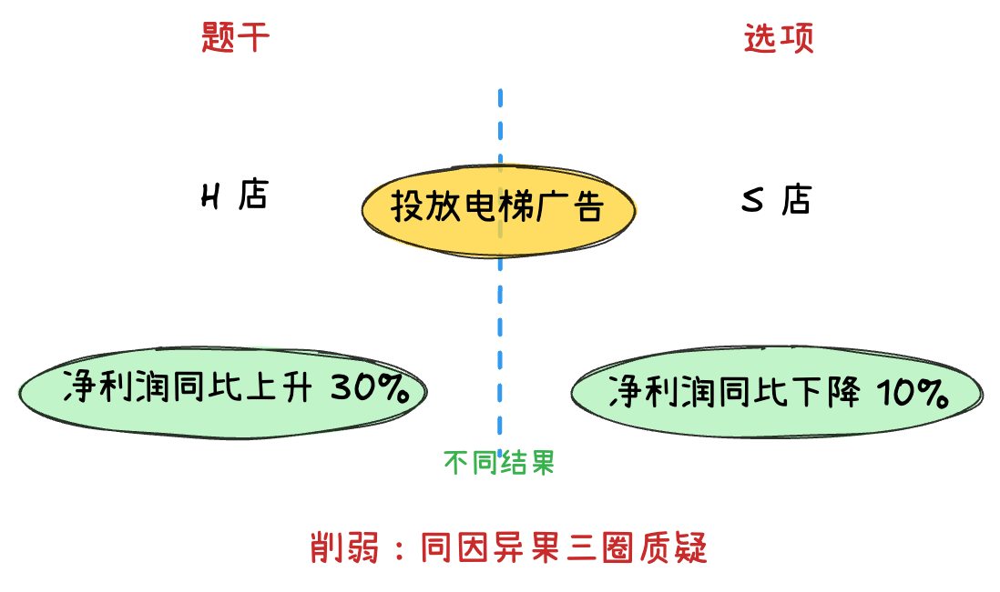

# 归因论证

## 归因论证概述 

### 常见问法
*   “以下哪项如果为真，最能削弱上述结论？”
*   “以下哪项如果为真，最能质疑研究人员的解释？”

### 题目形式
*   一般由对比实验和原因分析（对策建议）或不同平常或过往的既成事实和原因分析两部分组成 **（既成事实 + 原因分析）** *（对比实验归因）*
*   有些题目会省略原因分析的过程，直接给出结论或建议 *（一般归因）*

!!! example ""
    许多大城市的中小学校门口，在每天早晚交通高峰期都能看到接送孩子车辆排长龙。有人认为，开车接送孩子上学是导致交通严重拥堵的原因。

    *   *既成事实：学校门口堵车*
    *   *原因：开车接送孩子*

### 题型分类
1.  **对比实验归因**
2.  **时间对比归因**
3.  **一般归因** (只是省略了对比实验过程)
4.  **直接根本原因**
5.  **构成或补充对比实验**

---

## 对比实验归因

### 另有他因质疑

!!! tip ""
    **另有他因** 指的是在题干认为的原有原因之外，增加一个也可能导致结果的原因，从而降低原有原因成立的可能性。
    
    (另有他因选项往往只是“将水搅混”，而并非完全否定原有原因。)

- *正确选项特征：* **回归实验**，找到实验组和对照组的另一可能影响结果的不同点。

- *错误选项特征：*
    - **未谈论原因**
    - **未分组的典型伪他因**
    - **“有些”类选项**（有些/个别/特例...）
    - **实验瑕疵类选项**（样本量不足、样本未全覆盖...）

- *质疑力度：* **否定此因 = 因果倒置 > 另有他因**

???+ quote "例"

    === "例 1"

        ⠀⠀⠀某研究发现，连续 8 周每天服用 450~900 毫克茶氨酸后，被试的睡眠满意度显著提高。某厂商因此推出一款含有茶氨酸的饮料，并以该研究为主要内容拍摄广告，声称 **这款饮料有助于缓解失眠、促进睡眠**。

        以下哪项如果为真，最能 *质疑* 该厂商的说法：

        A. 该饮料茶氨酸含量较低，要达到 450 毫克的实验剂量，一天需要饮用 4~5 瓶

        B. 茶氨酸可通过影响大脑中的神经传导物质来减缓神经冲动，帮助缓解紧张情绪

        C. 茶氨酸易溶于水，能够消减咖啡碱引起的苦涩味并增强鲜味和甜味，使饮料味道更好

        ==D. 参与该研究的被试均患有症状为持续紧张不安的广泛焦虑症，且实验期间服用了抗抑郁药物== $\rightarrow$ *另有他因：睡眠质量提高有可能是因为服用了抗抑郁药物*

    === "例 2"
        ⠀⠀⠀心理学家曾做过一个实验，将被试者分为两组，给他们看同一张交通事故的照片，并询问有关车速的问题。对第一组问“你认为是以多快的速度相撞的”，而对第二组则问“你认为是以多快的速度猛烈撞击到一起的”。后者是让人想到撞击非常猛烈的表达方式。一周后，再询问被试者“汽车的挡风玻璃是否撞碎了”（实际上并没有撞碎）。结果显示，回答“是”的人，第二组的比例比第一组多两倍以上。心理学家由此得出结论：**人类的记忆并不是固定的，而是根据之后获取的信息而变化**。

        以下哪项如果为真，最能 *削弱* 心理学家的结论：

        A. 第二组被试者的人数比第一组的多

        ==B. 第二组被试者的记忆力本来就偏弱== $\rightarrow$ *另有他因：可能是因为第二组被试者记忆力弱*

        C. 时隔一周再询问的合理性有待斟酌

        D. 两组被试者在认知水平上没有差距

#### “继发关联”的另有他因
!!! tip ""
    **继发关联** 是指疾病 A 与疾病 B 并不存在因果关系，而是由于两者（A 和 B）有共同的原因 C 而产生的关联。
    
    归因论证中的“继发关联”指的是，**A 与 B 不存在因果关联，A 与 B 均是其共同原因 C 导致的结果**。
    
???+ quote "例"

    === "例 1"

        ⠀⠀⠀研究人员发现，在过去的一个半世纪中，出现过几次地球转速放缓时期，这种时期每次会持续 5 年左右，更为关键的是，地球转速放缓的同时伴随着强震增多。研究人员据此得出结论：**地球转速放缓导致强震多发**。

        以下哪项如果为真，最能 *质疑* 上述结论：

        A. 在地球转速放缓时期，每年约发生 25~30 次强震，在其他时期，约为 15 次

        B. 在地球转速放缓时期，发生火山喷发的次数与其他时期相比没有明显变化

        C. 地球转速放缓，会使昼夜长短发生变化，昼夜长短变化导致全球强震多发

        ==D. 地核的轻微变化，导致地球的转速放缓，也导致全球范围内的强震多发== $\rightarrow$ **C 导致了A 和 B：** *地核的轻微变化（C）导致了地球的转速放缓（A）和强震多发（B）*

    === "例 2"

        ⠀⠀⠀研究人员基于生物库大样本队列，采用生物电阻抗测量脂肪含量，分析其与死亡风险的关系，结果显示脂肪含量过少与死亡风险增高存在关联。研究人员认为，**脂肪含量过少的人，死亡风险会增高**。

        以下哪项如果为真，最能 *削弱* 上述结论：

        A. 在生活方式不健康的人群中，脂肪含量过多或过少均会增加死亡风险

        B. 脂肪含量过多给人体带来的死亡风险，高于脂肪含量过少带来的死亡风险

        ==C. 脂肪含量过少和死亡风险高都是由疾病带来的，疾病是二者的共同原因== $\rightarrow$ *疾病导致了脂肪含量过少和死亡风险增高*

        D. 低脂肪的饮食可以改善血脂的代谢、降低胆固醇、降低低密度脂蛋白的水平

#### 利用分组正确找到另有他因
!!! tip ""
    题干中有多种实验分组方式时，根据最终的结论确定实验组和对照组，并 **根据正确的分组找出另有他因选项**。

???+ quote "例"

    === "例 1"

        ⠀⠀⠀心理学家考察了 450 位中年男性和女性，他们中有白领阶层，也有蓝领阶层；有技能判断型人群，也有决策制定型人群。结果发现，那些身居重要职位的高管人士普遍比一般员工更胖。研究者认为，**做出许多决定** 所承受的压力通过饮食方式得到排解，这最终在一定程度上改变了高管人士之前的饮食习惯，如果你的职位幸运地得到晋升，你将发现不仅是薪水变多，自己的 **腰围也在变粗**，伴随着体重上升。

        以下哪项如果为真，最能 *质疑* 上述结论：

        A. 比较而言，技能判断型人群腰围较小，决策制定型人群腰围较大

        ==B. 比较而言，身居要职的高管人士更难抽出时间投入锻炼以缩小腰围== $\rightarrow$ *身居要职(做出许多决定)是因为没有时间锻炼导致腰围变粗*

        C. 每晋升一个工作等级，技能判断型人群的腰围平均会减少 0.5 厘米

        D. 每晋升一个工作等级，决策制定型人群的腰围平均会增大 0.28 厘米

    === "例 2"

        ⠀⠀⠀为加强对青少年的健康监测，科学家分析了 4257 名青少年的数据，这些孩子在 12 岁、14 岁和 16 岁的时候，戴着加速计，在至少 3 天的时间里跟踪他们至少 10 个小时并随访 6 年。加速计客观记录佩戴者是否正在进行轻度活动，是否正在进行中度体力活动，或者是否久坐。研究发现，在 12 岁、14 岁和 16 岁时，每天每增加 1 个小时的久坐时间，到 18 岁时抑郁评分分别增加 11.1%、8%、10.5%。科学家据此得出结论，**青少年久坐，不运动会增加抑郁症风险**。

        以下哪项如果为真，最能 *质疑* 上述结论：

        ==A. 这些久坐的青少年大多数沉迷恐怖类游戏，对他们精神造成严重影响== $\rightarrow$ *可能是因为恐怖游戏导致抑郁症*

        B. 这些孩子中，家境不好、长期奔波兼职的青少年也会患上抑郁症

        C. 这些孩子中，长期久坐的青少年最终学习成绩普遍好于同龄学生

        D. 与成年人相比，经常久坐不运动的青少年所占比例事实上很低

### 因果倒置质疑
!!! tip ""
    **因果倒置** 是一种在相对确定的条件下把原因和结果相互颠倒，**视结果为原因和视原因为结果** 而引起的谬误。

???+ quote "例"

    === "例 1"

        ⠀⠀⠀对许多人来说，**阿尔茨海默病** 是一种熟悉而可怕的疾病，虽进展缓慢但无情剥夺着患者的记忆力、辨别力还有认知力，使他们无法进行日常生活。一些研究认为，这种病主要是 **由于大脑内部蛋白质的异常积聚导致的**，这些异常积聚会在脑中形成 $\beta$-淀粉样斑块和缠结，最终导致突触（大脑中的连接节点）减少，从而降低认知能力。

        以下哪项如果为真，最能 *削弱* 上述结论：

        A. 在正常人群中，大脑组织里也会有一定数量的蛋白质存在，时多时少

        ==B. 在该病形成早期，神经突触就开始减少，这种减少引发了蛋白质的堆积== $\rightarrow$ *因果倒置：先有病，才有蛋白质堆积*

        C. 动物实验显示，如果消除动物脑部已形成的淀粉样斑块，并不能让突触减少

        D. 作为大脑中的神经连接，突触会被不断修剪，这是大脑正常发育的重要过程
        
    

    === "例 2"

        ⠀⠀⠀研究人员调查了女性晚年体重变化与健康状况的关系，发现 60 岁以上仍保持体重稳定的女性更容易活到 90~100 岁。研究显示，与体重减轻 5%或更多的老年女性相比，体重保持稳定的老年女性健康状况更好，其长寿的可能性高出 1.2 至 2 倍。与体重稳定的女性相比，体重至少减轻 5%的女性健康状况相对较差。研究人员由此认为，**老年女性体重减轻会导致其健康状况受损**。

        以下 *除哪项外*，均能 *削弱* 上述结论：

        A. 研究中活到 90 岁以上的老年女性，其家族成员寿命也普遍较高 $\rightarrow$ *另有他因*

        ==B. 生活习惯不良或情绪状态不佳等也会导致老年女性健康状况受损== $\rightarrow$ *伪他因（未回归实验）*

        C. 老年女性在不想减肥的时候却体重减轻，是健康状况不佳导致的 $\rightarrow$ *因果倒置*

        D. 如果医生建议老年女性减轻体重以改善健康，那么其应遵医嘱 $\rightarrow$ *否定此因*

    === "例 3 (力度比较)" 

        

        ⠀⠀⠀某社区近期举行了一项关于家庭饲养宠物与家庭生活幸福感关系的调查。此次调查走访了 100 户家庭，调查的内容包括宠物的种类、饲养宠物的时间、家庭成员的学历和职业等诸多方面。调查结果表明，饲养宠物的家庭，其家庭成员的幸福感普遍高于没有饲养宠物的家庭。这说明，**家庭饲养宠物有助于提升家庭生活幸福感**。
        
        以下哪项如果为真，最能 *削弱* 上述论证：

        A. 该调查所采集样本数量不足 $\rightarrow$ *实验瑕疵*

        B. 该社区饲养宠物的通常是那些居住条件较好的居民 $\rightarrow$ *另有他因*

        C. 没有饲养宠物的家庭，其家庭成员通常为工作较为繁忙的在岗职工 $\rightarrow$ *另有他因*

        ==D. 家庭饲养宠物通常 **是因为** 其成员有充裕的时间并具有较高的家庭生活幸福感== $\rightarrow$ *因果倒置：是因为幸福所以饲养宠物* (1)

        

        1. 质疑力度： **否定此因 = 因果倒置 > 另有他因**

### 否定此因质疑
!!! tip ""
    **否定此因** 并不探讨题干中某结果的原因是什么，只是否定题干中认定的原因。

???+ quote "例"

    === "例 1"

        ⠀⠀⠀某研究调查了数千名被试者的睡眠情况与健康状况，结果发现，从中年至老年（50 岁至 70 岁间）一直处于较短睡眠模式（即每晚睡眠时长少于 6 小时）的人，失智风险会增加 30%。研究者呼吁，**中老年人适当增加睡眠时长，可以预防失智的发生**。

        以下陈述如果为真，哪项最能 *质疑* 研究者的观点：

        A. 老年人每日睡眠时间过长不仅会有疲劳感，还会记忆力降低，精力不集中

        B. 随着年龄的增加，机体的细胞也慢慢衰老，这就导致睡眠时间开始变短

        C. 心血管代谢问题和精神疾患等都是失智的重要风险因素

        ==D. 失智是一种因脑部疾病所导致的渐进性认知功能退化，跟睡眠时长无大关== $\rightarrow$ *否定此因*

    === "例 2"

        ⠀⠀⠀国内有研究发现，在小学阶段，**春季出生的孩子比冬季出生的孩子学习成绩更好**，在学业上获得成功的概率也更高。有人据此推测，这是由于春季出生的孩子年纪更大一些，而 **年纪大的孩子往往更成熟，更容易获得老师的关注**。

        以下选项如果为真，最能 *反驳* 上述判断的是：

        A. 得到老师更多关注并不意味着一定有更多在学业上取得成就的机会

        ==B. 教育部门规定，小学生必须在当年 9 月 1 日前年满 6 周岁才能入学== $\rightarrow$ *否定此因：春季出生的孩子不一定比冬季出生的孩子大*

        C. 老师也会倾向于关注成绩不理想的学生

        D. 其他研究发现，成绩好的孩子普遍善于独立思考

### 排除他因支持 
!!! tip ""
    **排除他因支持** 指的是排除其他可能影响结果的原因的可能性，让题干中认定的原因成为唯一的可能原因，从而进行支持。

???+ quote "例"

    === "例 1"
        ⠀⠀⠀某团队开展了一项关于预防中风的研究。研究对象分为两组，一组食用 **低钠盐（约 75%的氯化钠和 25%的氯化钾）**，一组食用 **普通盐（约 97%的氯化钠）**。在 5 年的跟踪调查中发现，食用低钠盐的群体，其中风发病率显著低于食用普通盐的群体。因此，**减少钠的摄入有助于预防中风**。

        以下各项如果为真，最 *不能支持* 这一结论的是：

        ==A. 食用低钠盐的中风患者的死亡率远低于食用普通盐的中风患者== *无关项：讨论的是是否有助于预防中风*

        B. 两组研究对象在性别、年龄等方面不存在明显差异 $\rightarrow$ *排除他因*

        C. 研究期间，两组研究对象每日摄入的盐含量接近 $\rightarrow$ *排除他因*

        D. 摄入氯化钾不会影响中风发病率 $\rightarrow$ *排除他因*

    === "例 2"

        ⠀⠀⠀A 市近年来人才外流数量不断增加，然而自从许多外地大学迁移到 A 市以后，该市大学生就业率出现了严重下降。据此，有专家认为许多 **大学迁移到 A 市导致其就业率降低**。 

        据此，下面哪个选项为真，最能 *加强* 上述结论： $\rightarrow 就业率 = \frac{人才数}{企业数}$ *就业率低可能是因为人才多/企业少* 

        ==A. A 市在近 3 年内企业数量增加了 3 倍== $\rightarrow$ *排除他因：企业没少，说明是人才多导致的*

        B. A 市周围城市人才外流数量依然不断增加

        C. A 市在许多外地大学迁移之前就业率并不高

        D. A 市政府已经实施鼓励大学生自主创业的政策

---

## 时间对比归因
!!! tip ""
    **时间对比归因** 指的是当前与以往相比出现某种变化，并找到此种变化可能的原因。此时，可通过找到当前与过去的另一点不同，来进行他因削弱。注意，*一直存在且无变化的事实不会是某种变化的原因，“变化”才是“变化”的原因*。

???+ quote "例"

    === "例 1"

        ⠀⠀⠀**1990 年**，W 市 70 岁以上老人骨折发生率很高，同时，70 岁以上老人的死亡率也很高，因此可以得知，**骨折高发导致了 70 岁以上老人死亡率的上升**。

        以下哪项如果为真，最能 *削弱* 上述结论：

        ==A. 1990 年，W 市正在经历战乱== $\rightarrow$ *另有他因*

        B. W 市很多 70 多岁以上的老人都是独居老人

        C. 此后十年，W 市 70 岁以上老人的骨折率和死亡率一直很高

        D. W 市 60 岁到 65 岁老人骨折发生率是 70 岁以上老人的 2 倍

    === "例 2"

        ⠀⠀⠀某桃园 5 月份对其种植的嫣桃进行套袋。6 月份，桃果出现异常，50 克左右的大果很少；10 余克的小果特别多，约占 75%，正常情况下，此时果实应重 50 克左右。有人推测，**今年出现小果占比过大是由于套袋较早造成的**，因为过早套袋会使果实失去营养竞争力，在营养供应不足的情况下，果实竞争不过新梢。

        以下哪项如果为真，最能 *削弱* 上述推测：

        A. 今年套果袋时果实大小基本一致，并且期间无病虫危害

        B. 纸袋的遮光作用影响果实光合能力，进而影响甜度

        C. 今年在没有分出大小果实就完成了疏除冗余幼果的操作，留下的不一定是优质大果

        ==D. 今年桃树长得太快，加之萌芽肥、花后肥都没有追施，导致后期果实营养供应不足== $\rightarrow$ *另有他因*

---

## 一般归因
!!! tip ""
    **一般归因** 指的是没有明显的对比试验和时间对比，只针对某个既成事实进行归因（也可以看作是某种情况和其他情况的对比）。

???+ quote "例"

    === "例 1"

        ⠀⠀⠀红霉素是一种抗生素，最早从放线菌糖多孢红霉菌的分泌物中发现。最新研究中，人们发现一种名为文蛤的贝类体内也会分泌红霉素。红霉素主要由微生物合成，此前从未在动物体内发现，研究者据此推测，文蛤合成红霉素的能力应当源于文蛤体的微生物，正是这些 **微生物帮助文蛤合成了红霉素**。

        以下哪项如果为真，最能 *阻碍* 研究者的推测：

        ==A. 文蛤的基因组中具有红霉素合成基因，该基因表达在文蛤外套膜的粘液细胞中== $\rightarrow$ *另有他因*

        B. 文蛤贝壳下有一层外套膜，膜的上皮内分布着粘液细胞，它们能存储红霉素

        C. 通过对文蛤体内所有微生物进行检测，并没有发现糖多孢红霉素

        D. 研究者在其他贝类体内也发现了类似红霉素的抗生素

    === "例 2"

        ⠀⠀⠀为满足乘客用餐多样化的需要，某地区推出了旅客列车的 **互联网订餐** 服务。该服务上线一年以来，通过线上渠道（官网、订票APP等）进行了大量的宣传，但订单量除了刚推出的前三个月有小幅增长外，其他月份并未增长，甚至下降。由此可见，**该地区出行的旅客对列车提供的网上订餐服务需求量不高**。

        以下能够 *削弱* 上述结论的有几项：

        ==①接受旅客列车网络订餐的餐厅数量较少，食物品种相对单一== $\rightarrow$ *另有他因*

        ②即使推出了互联网订餐，大部分乘客还是愿意去空间较大的餐车用餐 

        ③该地区的短程列车数量较多，相比短程列车，长程列车的网上订餐量更大 

        ==④线上宣传缺少对用户的精准定位，许多订票用户并未注意到列车有网上订餐服务==$\rightarrow$ *另有他因*

        A. 1 项⠀⠀⠀⠀⠀⠀==B. 2 项==⠀⠀⠀⠀⠀C. 3 项⠀⠀⠀⠀⠀⠀D. 4 项⠀⠀⠀⠀⠀⠀

---

## 直接根本原因 
!!! tip ""
    **直接根本原因** 是一种固定题型，可直接“秒杀”，一般由原观点、反对者观点组成，多数设问为质疑反对者。正确答案一般为“原观点认为的原因”导致了“反对者认为的原因”，即原观点是根本原因，反对者是直接原因
    
???+ quote "例"

    === "例 1"

        ⠀⠀⠀有研究人员认为，人类 **脱发是由于营养不均衡导致** 的，当人体无法吸收到的营养，毛囊就会萎缩，从而导致脱发。但是，有反对者认为，**脱发是由于毛囊受损导致的**。当毛囊受损后，处于“假性死亡”状态，毛囊退化并萎缩，导致毛发停止生长，逐渐枯萎脱落。

        以下哪项如果为真，最能 *削弱* 反对者的观点：

        A. 长期营养不足的人往往头发枯黄，易脱发

        B. 使用洗发水也会对毛囊造成一定程度的损害

        ==C. 毛囊受损是由营养不均衡导致的== $\rightarrow$ *营养不均衡导致毛囊受损*

        D. 毛囊受损使其不能从头皮中吸收营养，从而导致脱发

    === "例 2"

        ⠀⠀⠀月球表面存在水分子，但其来源一直是未解之谜。一种观点认为：这些水主要 **来自地球大气层**，大气层中逸散的氢离子会进入月球表面，与月壤中原子结合形成水。而反对者认为：月球表面的水主要 **来自太阳风**（太阳大气射出的带电粒子流），这些粒子流中携带氢原子，当氢原子进入月球后，与月壤中的氧原子结合形成水。

        以下哪项如果为真，最能 *支持* 反对者的观点：

        A. 太阳风进入月球表面后，氢原子与相关物质作用可以形成氢氧基，逐渐形成水

        B. 太阳风形成水是一个缓慢的过程，但通过数十亿年的累积，月球水的数量也相当可观

        C. 地球大气层的氢离子只有在地月距离近时才会进入月球，而月球的水早在月球形成之初就存在，那时地月距离较远

        ==D. 地球大气层逸散氢离子是太阳风磁场作用的结果，在太阳风的压缩下地球形成磁尾并不断逸散氢离子==

---

## 构成或补充对比实验 

### 构成对比实验
!!! tip ""
    **构成对比实验** 指的是选项与题干分别列为实验组和对照组，通过“异因异果”进行支持（四圈支持）或通过“异因同果”/“同因异果”进行质疑（三圈质疑）。

???+ quote "例"

    === "异因同果三圈质疑"

        

        ⠀⠀⠀今年“五一”期间，某品牌服装店进行促销活动，根据顾客身份证上的出生年份打折，如1986年出生的，打86折，1999年及以后出生的统一打99折。该活动由干宣传到位，备货充足，顾客盈门，“五一”假期 **销售额同比增长40%**。该服装店老板认为此次 **促销活动非常成功**。

        以下哪项如果为真，最能 *反驳* 该服装店老板的结论：

        A. 1986年到1996年出生的顾客占比超过80% $\rightarrow$ *无关项*

        B. 今年“五一”假期全国服装销售额同比增长45% $\rightarrow$ *其他服装销售店做没做活动不知道*

        C. 今年“五一”假期比去年多一天，消费者有更多的购物时间 $\rightarrow$ *考虑实际情况，多一天不太能增长40%*

        ==D. 另一个街区该品牌服装店没有促销活动，“五一”假期销售额也增长了40%== $\rightarrow$ *排除他因，控制变量。市场是一样的，面向人群是一样的异因同果* (1)

        

        1. {width=300}

    === "同因异果三圈质疑"

        

        ⠀⠀⠀一家全国连锁珠宝店的H分店，去年在当地投放大量电梯促销广告。广告投放后，客流量激增，净利润和前一年同期相比增长了30%。可见 **电梯促销广告对于提高企业利润十分有效**。假设G、M、R、S是与H分店规模、位置等具有可比性的其他4家分店，则下列最能 *削弱* 上述论证的是：

        A. G 分店，去年没有投放电梯广告，利润比H分店更高 $\rightarrow$ *应看利润同比增长*

        B. M 分店，去年选择投放了报纸广告，销售额同比提升了30% $\rightarrow$ *应看利润同比增长*

        C. R 分店，去年投放大量电梯广告，销售额却比H分店低 $\rightarrow$ *应看利润同比增长*

        ==D. S 分店，去年投放大量电梯广告，利润同比下降了10%== $\rightarrow$ *同因异果补充对照组，三圈质疑* (1)

        

        1. {width=300}

    === "异因异果四圈支持"

        

        ⠀⠀⠀某居民小区盗窃案件频发，在小区居民的要求下，物业于去年年初为该小区安装了一种多功能防盗系统，结果该小区盗窃案件的发生率显著下降，这说明多功能防盗系统能够有效降低盗窃案件的发生率。

        以下哪项如果为真，最能 *加强* 上述结论：

        ==A. 去年，没有安装这种防盗系统的居民小区盗窃案件显著增加== $\rightarrow$ *异因异果、四圈支持* (1)

        B. 附近另一个居民小区也安装了这种防盗系统，但是效果不佳 $\rightarrow$ *三圈质疑*

        C. 从去年初开始，该城市加强了治安管理，盗窃案件大幅减少 $\rightarrow$ *另有他因：盗窃变少可能是治安管理更好了*

        D. 物业采取其他防盗措施，对预防盗窃案件也起到一定的作用 *另有他因：其他防盗措施降低了盗窃率*

        

        1. {width=300}

### 补充对比实验
!!! tip ""
    **补充对比实验** 指的是选项本身即是一个对比实验，通过对比实验结果进行支持或削弱。

???+ quote "例"

    === "例 1"

        ⠀⠀⠀**阿尔茨海默病** 是一种较为严重的疾病，**4 号基因突变** 曾被认为是阿尔茨海默病的一项致病因素。但近期有科学家提出导致这一复杂疾病的病因可能很简单，就是一些 **能引起脑部感染的微生物，如 HSV-1 病毒**。

        以下哪项如果为真，最能 *支持* 上述科学家观点的：

        A. 当大鼠脑部受到 HSV-1 感染时，携带 4 号突变基因的大鼠产生的病毒 DNA 是正常大鼠的 14 倍

        ==B. 携带 4 号突变基因同时感染了 HSV-1 病毒的人群罹患阿尔茨海默病的概率会比单独具有此类突变基因的群体高 2 倍==

        C. 有些携带 4 号突变基因的患者使用抗病毒药物治疗后，其病情有所好转

        D. 在一些健康老年人的大脑中也存在着 HSV-1 病毒

    === "例 2"

        ⠀⠀⠀**慢性疲劳综合征** 危害极大，它使人在正常的工作后感到极度疲劳，怎么休息也无济于事。这种疾病过去不能通过验血或其他检查得出明确的生物指标，因此其病因历来被归为心理因素。最近，研究人员对诊断为慢性疲劳综合征的 48 名患者和 39 名健康志愿者的大便和血液样本进行研究后得出结论：**肠道细菌和血液中的致炎因子可能与该疾病{++有关++}**。

        以下哪项如果为真，最 *不能支持* 上述结论：

        A. 该疾病患者的大便样本中肠道细菌的多样性较低且抗炎细菌较少

        B. 该疾病患者的血液样本中被检测出致炎因子，而健康志愿者没有

        C. 目前不确定肠道细菌是导致该疾病的原因还是该疾病导致的结果

        ==D. 最新研究表明饮食治疗和益生菌等无助于为该疾病患者缓解疲劳==

---

