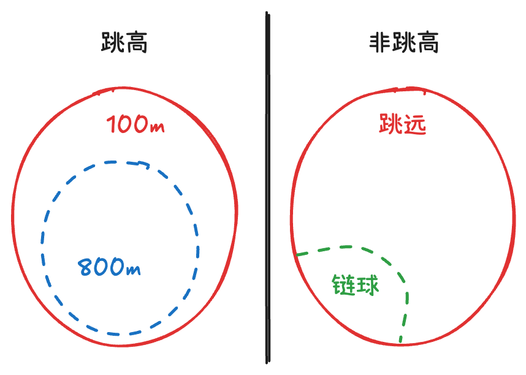
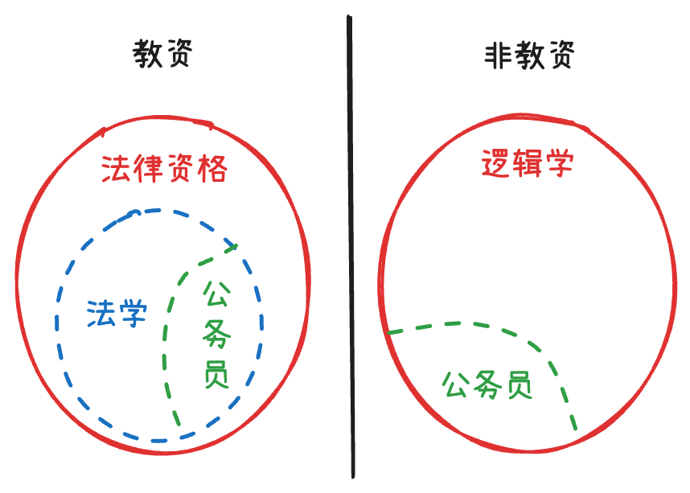

# 推出推理

## 等价推出
!!! tip ""
    **等价推出** 指的是将题干逻辑关系和选项逻辑关系分别翻译后，二者完全一致。
    
    考察的是对翻译规则的掌握，常用知识点有命题的逻辑题和逆否命题（a→b 和 非b→非a）等价。
    
    题干中无逻辑关联词的句分不需要关注，直接寻找带有逻辑关联词的语句即可。

*   [翻译规则](逻辑基础/#_19){ data-preview }

*   **只找同伙，无论对错**
    *   $A \rightarrow B \rightarrow C \iff ¬C \rightarrow ¬B \rightarrow ¬A$
    *   *忠于箭头 (肯定向右，否定向左)*
    *   *如果选项是以 C 或 ¬A 开头，那么推不出任何东西*
*   **常见错误选项**：比较类、原因类。（比较和原因分析都不是逻辑推理的过程，所以不选）

### 与题干等价

!!! tip 

    ① 若将题干翻译为 A→B，可以翻译 A→B 或 非B→非A 为正确选项。因此，以 B 或 非A（肯后或否前）开头的选项可先排除。

    ② 若题干有多个带有逻辑关联词的句子，先不需要联立，有时答案只和其中一句有关。

    ③ “A、B“ ,“A，B“，表示的是 “A且B“，不能写成 “A→B“ 或 “B→A“。

???+ quote "例"

    === "例 1"

        ⠀⠀⠀土地荒漠化是人为因素和自然因素综合作用的结果，想要在土地退化的地区恢复人与自然和谐共生的状态，必须提高土地荒漠化防治的科学性。一方面，**把握积极作为和有所不为的平衡**，即一手抓人工治理，一手抓自然修复；另一方面，**提高防治精细化水平**。如果 **同时做到上述两个方面，土地荒漠化防治的科学性自然得到了提高**。 
        
        $\rightarrow$ *把握积极作为和有所不为的平衡 且 提高防治精细化水平 → 荒漠化防治的科学性自然得到了提高*

        由此可推出：

        A. 只有在土地退化的地区恢复人与自然和谐共生的状态，才能提高土地荒漠化防治的科学性

        B. 如果土地荒漠化防治的科学性得到了提高，则说明在土地退化的地区恢复了人与自然和谐共生的状态

        ==C. 如果土地荒漠化防治的科学性没有得到提高，则说明或者没有把握积极作为和有所不为的平衡，或者没有提升防治精细化水平== $\rightarrow$ *否后推否前*

        D. 如果土地荒漠化防治的科学性得到了提高，则说明把握积极作为和有所不为的平衡，以及提升防治精细化水平一定同时得以实现

    === "例 2"

        ⠀⠀⠀有人说，工作的时候，我们要将重要事务放在主要位置。**重要事务是必要条件，关系着一件事情成功与否**。重要的事务没做好，一定不成功。但是，细节也是很重要的，**细节是成功的充分条件**，同样也与一件事情成功与否息息相关。一个成功的人是能够协调好重要事务与细节的关系的。 
        
        $\rightarrow$ *成功 → 重要事务做好；细节 → 成功*

        由此可以推出： 

        ==A. 成功并不代表着所有细节都处理好了== $\rightarrow$ *肯后推不出任何结论*

        B. 如果不成功则说明重要事务没有做好 $\rightarrow$ *肯前无结论*

        C. 成功的前提条件是既要做好重要事务，又要处理好细节 $\rightarrow$ *细节是充分条件*

        D. 虽然处理好了细节，但没做好重要事务，也不一定成功 $\rightarrow$ *细节 → 成功 → 做好重要事务；题干本身就矛盾了*

### 与题干不等价

!!! tip 

    若题干只有一个逻辑关系，可直接翻译选项，选项三个相同一个不同，直接选不同的选项即可。

???+ quote "例"

    === "例 1"

        ⠀⠀⠀我国传统俗谚：“吃得苦中苦，**方** 为人上人。” 
        
        $\rightarrow$ 人上人 → 苦中苦*

        据此，*不能推出：*

        A. 只有吃得苦中苦，才能成为人上人 $\rightarrow$ *人上人 → 苦中苦*

        B. 除非吃得苦中苦，否则成不了人上人 $\rightarrow$ *人上人 → 苦中苦*

        ==C. 若能吃得苦中苦，则能成为人上人== $\rightarrow$ *苦中苦 → 人上人*

        D. 凡成为人上人的都要吃得苦中苦 $\rightarrow$ *人上人 → 苦中苦*

    === "例 2"

        ⠀⠀⠀要稳定地 **提高在逻辑考试上的成绩，关键是要在基本概念上有真正的理解**，如果没有真正的理解，即使投入再多的精力，做再多的练习，也不可能取得真正稳定的好成绩。
        
        $\rightarrow$ *提高成绩 → 理解概念*

        以下各项选项中，*除了哪项外*，都表达了与上述言论相同的意思：

        A. 只有在基本概念上有真正的理解，才能取得真正稳定的好成绩 $\rightarrow$ *好成绩 → 理解概念*

        B. 除非在基本概念上有真正的理解，否则不能取得真正稳定的好成绩 $\rightarrow$ *好成绩 → 理解概念*

        ==C. 只要在基本概念上有真正的理解，即使没有花很多精力，也能取得真正稳定的好成绩== $\rightarrow$ *理解概念 → 好成绩*

        D. 如果取得了真正稳定的好成绩，说明一定在基本概念上了有了真正的理解 $\rightarrow$ *好成绩 → 理解概念*

---

## 正推/逆推

*   **正推**：根据题干的推理过程 + 确定的事实，得出推理结果。
    *   *【例】已知 $A \rightarrow B, B \rightarrow C, C \rightarrow D$。可以得出 $A \rightarrow D$。* （递推）
*   **逆推**：根据题干给的结果，反向推出需要的前提条件。
    *   例】如果甲和乙都上岸了，那么丙也一定能上岸。问：若甲没上岸，需要什么前提？
    *   *【解】原命题：甲和乙 $\rightarrow$ 丙。逆否命题：¬丙 $\rightarrow$ ¬甲或¬乙。“或” 否一推一：所以选出的前提是：丙没考上，乙考上了。*

### 根据已知事实正推
!!! tip 

    无需将题干中的多个命题联立，根据已知事实，按照逻辑传递规则推出即可。

???+ quote "例"

    === "例 1"

        ⠀⠀⠀如果不在国家机关工作，小张就会失去今后晋职深造的机会；而如果不在民营企业工作，小张就不能提高自己的工资收入。小张不能既在国家机关工作又在民营企业工作。如果不能提高自己的工资收入，小张就买不起婚房。虽然小张女朋友不介意婚房的有无，但小张女朋友的父母很介意，小张自己也很介意。他暗下决心：如果买不起婚房，自己宁肯不结婚。最近，一直内心纠结的小张终于 **结婚了**。

        $\rightarrow$ *结婚了 → 买了婚房 → 工资提高 → 民营工作；否一推一：不在国家机关*

        根据以上信息，可以得出以下哪项：

        ==A. 小张现在不在国家机关工作==

        B. 小张现在不在民营企业工作

        C. 小张不会失去今后晋职深造的机会

        D. 小张女朋友的父母最后改变了想法

    === "例 2"

        ⠀⠀⠀小张这个夏天如果去新疆，就要游吐鲁番和喀纳斯，否则就不去；只有与小李同游，小张才会游吐鲁番或天池；如果与小李同游，小张一定要与小李做约定；如果小张与小李做约定，则小李这个夏天一定要有时间。遗憾的是，这个夏天小李单位来了一项紧急任务，相关人员一律 **不得请假**，小李也不例外。

        $\rightarrow$ *小李没时间 → 没约定 → ¬同游 → ¬(吐鲁番 或 天池) → ¬新疆*

        由此可以推出：

        A. 小张这个夏天去游天池

        B. 小张这个夏天游吐鲁番

        ==C. 小张这个夏天未去新疆==

        D. 小张这个夏天游喀纳斯

### 根据所需结果逆推

!!! tip 

    首先将要得出的结论翻译到箭头后。
    
    要得到 C，根据 B→C，需要 B 成立，要得到 B，根据 A→B，需要 A 成立，一步一步逆推即可。
    
    最常考点是“a 或 b”的“否一推一”，即要想 a 成立，需要 b 不成立。

???+ quote "例"

    === "例 1"

        ⠀⠀⠀假设“如果甲爱看越剧或乙不爱看越剧，那么丙爱看越剧”为真。

        $\rightarrow$ *甲爱看 或 乙不爱看 → 丙爱看*

        由下列哪项可推出“**乙爱看** 越剧”的结论：

        ==A. 丙不爱看越剧== $\rightarrow$ *丙不爱看 → ¬(甲爱看 或 乙不爱看) → 甲不爱看 且 乙爱看*

        B. 甲不爱看越剧

        C. 甲和丙爱看越剧

        D. 甲和丙有一个不爱看越剧 

    === "例 2"

        ⠀⠀⠀吴老师、张老师、孙老师、苏老师都是某校教师，每位只教授语文、生物、物理、化学中的一门课程。

        已知：

        ①如果吴老师教语文，那么张老师不教生物

        ②或者孙老师教语文，或者吴老师教语文 $\rightarrow$ *孙 = 语文 或 吴 = 语文*

        ③如果张老师不教生物，那么苏老师不教物理

        ④或者吴老师不教化学，或者苏老师教物理

        下列哪项如果为真，可以推出 *孙老师教语文*： $\rightarrow$ **即：吴 ≠ 语文**

        A. 吴老师教语文

        B. 张老师不教生物

        ==C. 吴老师教化学== $\rightarrow$ *吴 = 化学 → **吴 ≠ 语文***

        D. 苏老师不教物理

---

## 两难推理

*   $A \rightarrow B$、$¬A \rightarrow B$ 两个命题都为真，可推出 **B成立** (无论A如何，B都发生)。
*   $A \rightarrow B$、$A \rightarrow ¬B$ 两个命题都为真，可推出 **非A成立** (前件为假，命题为真)。

???+ quote "例"

    === "例 1"

        ⠀⠀⠀某高校需派 2 名左右的学生到乡村支教。众学子纷纷报名。学校经过综合考虑，将人选集中在甲、乙、丙三人身上，并达成一致意见：

        ①如果甲去，那么乙也去；$\rightarrow$ *甲 → 乙*

        ②只有丙去，甲才不会去；$\rightarrow$ *¬甲 → 丙*

        ③如果乙去，那么丙就去；$\rightarrow$ *乙 → 丙*

        ④甲和丙不可能都去。 $\rightarrow$ *¬甲 或 ¬丙*

        据此可知： 
        
        $\rightarrow$ **甲 → 乙 → 丙；¬甲 → 丙；丙去 → 甲不去**

        A. 甲会去，而丙不会去

        B. 乙会去，而甲不会去

        ==C. 丙会去，而甲不会去==

        D. 丙会去，而乙不会去

    === "例 2"

        ⠀⠀⠀某大学有高等数学、线性代数选修。甲、乙、丙 3 个学生针对选择的情况有如下说法：

        甲：“如果乙选高等数学，那么我不选高等数学” $\rightarrow$ *乙 = 高数 → 甲 ≠ 高数*

        乙：“如果丙选线性代数，那么我不选高等数学” $\rightarrow$ *丙 = 线代 → 乙 ≠ 高数*

        丙：“如果我不选线性代数，那么甲选高等数学” $\rightarrow$ *丙 ≠ 线代 → 甲 = 高数*

        如果他们三个说的都是正确的，那么以下说法一定正确的是：
        
        $\rightarrow$ **丙 ≠ 线代 → 甲 = 高数 → 乙 ≠ 高数；丙 = 线代 → 乙 ≠ 高数**

        A. 甲选高等数学

        ==B. 乙不选高等数学==

        C. 丙选线性代数

        D. 丙不选高等数学

---

## 范畴推理
!!! tip ""
    **范畴推理** 指的是根据直言命题（所有、有些、特指）之间关系和性质进行推理的题目，也包括判定集合之间包含、交叉等关系的题目。

[范畴关系](逻辑基础/#_12){ data-preview }

[可能关系](逻辑基础/#_13){ data-preview }

- **所有、有些的否定**：两词互换，后面加不
- **推出关系**：所有能推出有些、特指，特指能推出有些，有些推不出所有、特指
- **有些的特殊考点**：有些是推不出有些不是，有些 a 是 b 可以推出有些 b 是 a

### 直言命题

???+ quote "例"

    === "例 1"

        ⠀⠀⠀**品学兼优的学生不都读研究生**。如果以上论述为真，则下列命题 *能判断真假* 的有几个：
        
        $\rightarrow$ **题干：不所有 $\iff$ 有些不**
        
        I. 有些品学兼优的学生读研究生 $\rightarrow$ *有些是*
        
        II. 有些品学兼优的学生不读研究生 $\rightarrow$ **有些不**
        
        III. 所有品学兼优的学生都读研究生 $\rightarrow$ **所有都（假）**
        
        IV. 所有品学兼优的学生都不读研究生 $\rightarrow$ *所有不*
        
        A. 1⠀⠀⠀==B. 2==⠀⠀⠀C. 3⠀⠀⠀D. 4

    === "例 2"

        ⠀⠀⠀这个班级已发现 **有学生考试作弊**，如果上述断定是真的，则在下列三个断定中：

        $\rightarrow$ **题干：有些是**

        ①这个班级没有学生考试作弊 $\rightarrow$ *所有不*

        ②这个班级的有学生考试没有作弊 $\rightarrow$ *有些不*

        ③这个班级所有学生考试都没有作弊 $\rightarrow$ **所有不（假）**

        *不能确定真假* 的只有：

        A. ①⠀⠀⠀B. ②⠀⠀⠀C. ②③⠀⠀⠀==D. ①②==

### 集合关系
!!! tip ""

    *   找 **所有 xx 都 {++xx++}** 和 **所有 xx 都 {++非 xx++}**
    *   一分为二画图：分别在 **{++xx++}** 和 **{++非 xx++}** 两边画图

???+ quote "例"

    === "例 1"

        ⠀⠀⠀某学校举办田径运动会，所有参加 800 米跑的运动员都参加了 100 米跑，**所有参加 100 米跑的运动员都参加了跳高**，有些参加跳远的运动员参加了投掷链球，**所有参加跳远的运动员都没有参加跳高**。

        { align=right width=300}

        根据以上陈述，*不能推出* 以下哪项：

        A. 所有参加 800 米跑的运动员都参加了跳高 

        B. 有些参加投掷链球的运动员没有参加跳高

        C. 所有参加跳远的运动员都没有参加 100 米跑

        ==D. 有些参加 800 米跑的运动员参加了跳远==

    === "例 2"

        ⠀⠀⠀所有法学专业的学生，都获得了法律职业资格证书；**所有获得法律职业资格证书的学生，都获得了教师资格证书**；有些法学专业的学生成为了公务员；有些逻辑学专业的学生成为了公务员；**所有逻辑学专业的学生都未获得教师资格证书**。

        {align=right width=300}

        如果以上判定为真，以下哪项说法 *一定为假*：

        A. 一个人获得了教师资格证书，但并非逻辑学专业的学生

        B. 一个公务员，既没有获得法律职业资格证书，又不是逻辑学专业的学生

        C. 一个人获得了法律职业资格证书，但并非是法学专业的学生

        ==D. 一个人是逻辑学专业的学生，并且获得了法律职业资格证书==

---

