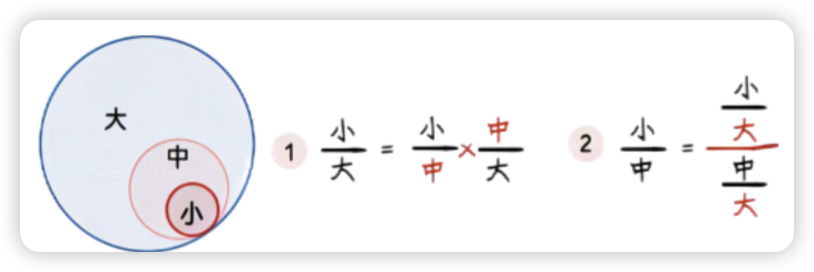

---
tags:
  - note
icon: lucide/chart-pie
---

# 比重类

*   **本期比重**：比重 = 部分 / 整体。**多部分比重：比重和/差 = (部分和/差) / 整体**。

	??? tip

		比重：套用公式即可，比重＝部分/整体、部分＝整体×比重、整体＝部分/比重；

		部分比重和或比重差：套用公式即可，比重和（比重差）＝部分和（部分差）/整体；

		饼状图：确定各部分所占比例，多利用 1/2、1/3、1/4、1/8 等或两部分之间的倍数关系，注意饼图中各部分的位置关系一般为从 12 点钟方向起，顺时针依次排列；

*   **基期比重**：基期比重 = 现期比重 $\times \frac{1+R_{整体}}{1+R_{部分}}$。

	!!! tip ""
		基期平均值、基期倍数、基期比值均可看作是“基期比重”，利用基期比重公式进行计算。

*   **隔级比重**：相当于找了一个中间量做过渡。

	{width=60%}

*   **比重趋势**：
    *   **直接找增长率比较！**
    *   **分子的增长率 > 分母，分子涨的快，比重变大**。
    *   **分子的增长率 < 分母，分子涨的慢，比重变小**。
    *   逆运用：*比重变大 $\rightarrow$ 分子涨的快；比重变小 $\rightarrow$ 分子涨的慢*。
*   **比重差**：
    *   比重差 = 本期比重 - 基期比重 = $\frac{\text{基期部分 } a}{\text{本期整体 } B} \times (R_{部分} - R_{整体})$。
    *   **秒杀技**：一般来说，基期部分/本期整体 < 1，所以 **比重差 < |增长率之差|**。
    *   **解题步骤**：
        1.  先求出 **部分增长率 - 整体增长率**。根据 R部分 - R整体 判断比重是上升 (>0) 还是下降 (<0)，排除两个选项。
        2.  代入比重差公式计算。
*   **比值差**：
    *   识别：单价下降最多的是...
    *   公式：$\frac{\text{去年出口额 } a}{\text{今年出口量 } B} \times (R_{额} - R_{量})$。

---

## 比重差表格总结

| 类型 | 分子分母单位 | 选项单位 | 问法特征 | 公式 |
| :--- | :--- | :--- | :--- | :--- |
| **比重差** | 相同 | 百分点或% | 基期部分a，本期整体B... 比重，与上年相比... 占比，与上年相比 | $\frac{a}{B} \times (R_a - R_B)$   **可秒杀 |比重差| < |增速差|** |
| **比值增长率** | 一般不同 | % | 满足 $c = a/b$，平均、增长率 | $\frac{R_a - R_b}{1 + R_b}$ |
| **比值差** | 一般不同 | 实际量 (例：元、人) | 与上年相比 (例：人均收入与上年相比) | $\frac{a}{B} \times (R_a - R_B)$   **不可秒杀** |

---

??? quote "例：比重趋势的逆运用"

	**【例】(2020 事业编联考)** 2019年1～10月，全国快递服务企业业务量累计完成496.6亿件，同比增长26%；业务收入累计完成5929 亿元，同比增长24%。
	2019年1～10月，东、中、西部地区快递业务量比重分别为79.8%、12.7%和7.5%，比1～9月增加-0.1%、0.1%和0%；
	业务收入比重分别为80.3%、11.2%和8.5%，比1～9月增加-0.1%、0.1%和0。
	与去年同期相比，东部地区快递业务量比重下降0.1个百分点，快递业务收入比重上升0.3个百分点；中部地区快递业务比重上升0.5个百分点，快递业务收入比重基本持平；
	西部地区快递业务量比重下降0.4个百分点，快递业务收入比重下降0.3个百分点。2019年1～10月份，中部地区快递业务量同比增速可能为：

	A.16%⠀⠀⠀⠀⠀⠀  B.21%⠀⠀⠀⠀⠀⠀  C.26%⠀⠀⠀⠀⠀⠀  D.31%⠀⠀⠀⠀⠀⠀

	---

	**【解】D**
	
	方法一（比重趋势逆运用）：中部地区比重上升，说明中部增速要大于全国的增速。
	
	全国快递业务量 $R2=26\%$，选D。
	
	方法二（乘积增长率）：中部业务量 = 全国 $\times$ 占比，已知全国 $R=26\%$。
	
	$R_{\text{占比}} = \frac{X}{A} = \frac{0.5}{12.7-0.5} \approx 4\%$，$R = 26\% + 4\% + 4\% \times 26\% \approx 31\%$，选 D。

??? quote "例：比重差"

	**【例】(2022 年国考)**
	2020 年，C 市天然气用量为 107.47 亿立方米，同比增长 3.83%。其中，中石化供33.51 亿立方米，同比增长 8.8%。2020 年，中石化供气量占 C 市天然气用量的比重比上年：
	
	A. 减少了不到 3 个百分点   ⠀⠀⠀⠀⠀⠀B. 增加了不到 3 个百分点
	
	C. 减少了 3 个百分点以上   ⠀⠀⠀⠀⠀⠀D. 增加了 3 个百分点以上
	
	---

	**【解】B** 
	
	第一步判断趋势：找 R1 和 R2，判断是上升还是下降。
	
	中石化供气量 $R1 = 8.8\%$，C市天然气用量 $R2 = 3.83\%$。分子增速大于分母增速重上升，排除 AC。
	
	第二步比较增速差：比重差 < 增速差。增速差 $= 8.8\% - 3.83\%$，故比重差 < 5%。
	
	第三步套公式：中石化供应本期为 33.51 亿立方米，增长率 $R=8.8\%$，由假设分配步得 $a=30$ (大胆算)。
	
	则有 $30/107 \times (8.8\% - 3.83\%) = 30\% \times 5\% = 1.5$ 个百分点。选 B。

---
