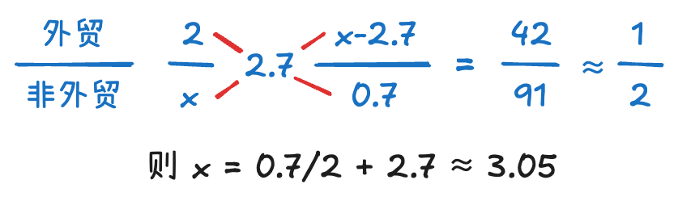
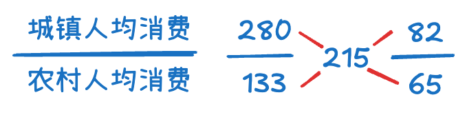

---
tags:
  - note
icon: lucide/waves
---

# 盐水类

## 十字交叉法
>   ==**十字交叉法求出来的是分母之比！**==

*   **适用前提：** 三量之间存在整体与部分的加和关系。
    *   $R = \frac{\text{部分} 1 \times \text{部分} 1 \text{率} + \text{部分} 2 \times \text{部分} 2 \text{率}}{\text{部分} 1 + \text{部分} 2}$
*   **公式：**
    $$ \begin{aligned} \frac{溶液 A 浓度}{溶液 B 浓度} \end{aligned} \times \text{混合溶液浓度 R} \quad \Rightarrow \quad \frac{R - B}{A - R} = \frac{\text{溶液 A 质量}}{\text{溶液 B 质量}} $$
  
* **应用场景：**
    *   全国 = 城镇 + 农村
    *   居民 = 男性 + 女性
    *   房地产 = 房产 + 地产
    *   进出口 = 进口 + 出口
    *   全部 = 限额以上 + 限额以下
    *   时间分段

??? abstract "使用盐水思维常见类型"

	① 整体增长率和两部分增长率，如进出口额增长率和进口额增长率、出口额增长率
	
	② 累计（累计量=当月量+上月累计量）增长率和两部分（当月量、上月累计量）增长如 1～12 月增长率和 1～11 月、> 12 月增长率
	
	③ 整体时间增长率和两部分时间增长率，如上半年增长率和一季度、二季度增长率
	
	④ 主体存在相加关系的增长率，如出口额增长率和贸易顺差、进口额增长率（出口额=顺差+ 进口额）
	
	 ⑤ 整体平均数和两部分平均数，如全国人均收入和城镇居民人均收入、农村居民人均收入  ⑥ 整体比重和两部分比重，如东西部地区城镇化率和东部地区、西部地区城镇化率

---

## 定性分析
*   **原则：** 在中间，不在正中间（混合溶液浓度靠近量大的一方）。
*   **增速大小比较：** *部分 1 > 整体 > 部分 2*
	
	(*增速相近、R 较小、选项差距大，可用现期代替基期*)

---

## 定量分析
#### 增长率相关
1.  已知 3R 求量之比
2.  已知 2R 和量之比，求另一 R
    *   $R = X/A$，若 **代入十字交叉法的是 R，则算出来的是 A (基期) 之比！**

??? quote "例：已知 2R 和量之比，求另一增长率"

	**【例】(2022 年山东)** 2018年我国全年规模以上港口完成货物吞吐量133亿吨，同比增长 2.7%，其中外贸货物吞吐量 42亿吨，同比增长 2.0％。
	2018 年我国全年规模以上港口完成非外贸货物吞吐量同比增速：

	A. 低干 1.5%⠀⠀⠀⠀⠀⠀ B. 在1.5%～2.5%⠀⠀⠀⠀⠀⠀ C. 在 2.5%～3.5%⠀⠀⠀⠀⠀⠀ D. 高干 3.5%
	
	---

	**【解】C**
	
	方法一：线段法直接判断：
	
	-   货物吞吐量=外贸+非外贸，这里增长率小，用现期代替了基期：非外贸=133-42=91 亿吨，非外贸量大，如果 2。7 是中间，左边一格：2.7-2=0.7，那么右边应该是 3.4，但是 2.7 更靠近右边，所以是在 2.7-3.4 之间，选 C

    方法二：十字交叉法

	{width=300}
    	

#### 人数相关
1.  已知某率或某平均数，求人数之比
2.  已知 2R 和量之比，求另一 R
    *   $\text{人均} = \text{总量} / \text{总人数}$。若 ==**代入十字交叉法的是人均，则算出来的是人数之比！**==

??? quote "例：已知 3R 求量之比"

	**【例】(2021 年江苏)** 2019年，全国居民人均可支配收入30733元，比2000年增长4.4倍。全国居民人均消费支出21559元，比2012年增长78.9%，年均增长8.7%。其中，城镇居民人均消费支出28063元，比 2012年增长64.0%；农村居民人均消费支出13328元，比2012年增长99.9%。2019年城镇居民人口占总人口的比重约为：

	A. 52.7% ⠀⠀⠀⠀⠀⠀B. 53.8% ⠀⠀⠀⠀⠀⠀C. 54.1% ⠀⠀⠀⠀⠀⠀D. 55.9%

	---
	
	**【解】D** “求人数，想盐水”，*人均消费 = 总体消费 / 总人数*

	{width=300}

	则城镇居民人口占总人口的比重 $= 82 / (82+65) \approx 56\%$。

#### 方法
-   **列公式**：1-12月累计=1-11月累计＋12月
-   **找关系**：R(12月) > R(1-12月累计) > R(1-11月累计)

---

